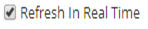
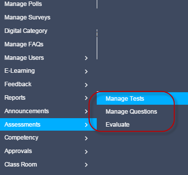
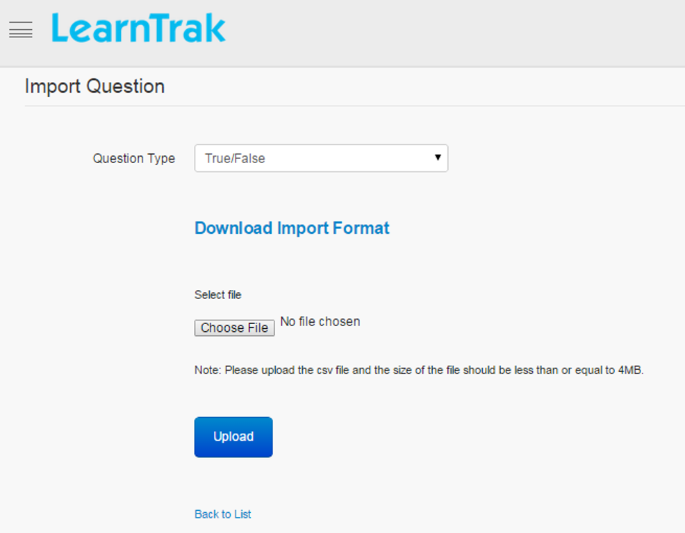
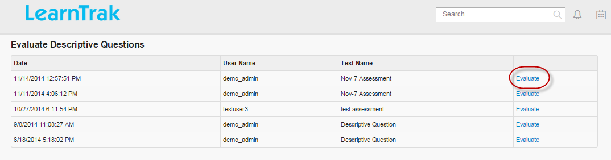
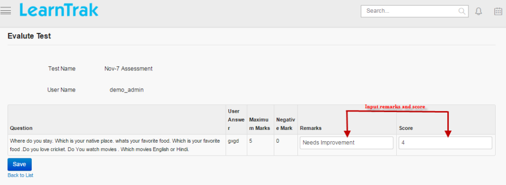

.. _assessment:
.. _import questions:
.. |Admin| image:: _static/admin_button.png
.. |Delete-Button| image:: _static/usr_del_tab.png
.. |Edit-Button| image:: _static/usr_edit_tab.png
.. |User-Details| image:: _static/usr_det_tab.png

**Assessments**
==============
* The assessment engine of LMS helps to create, manage and publish assessments as tests. The LMS assessment engine follows the IMS QTI standard.
* An assessment is sub-categorized into: *subjects, topics and questions*.
* The administrator can perform events like creating, editing and deleting the subjects, topics, questions and also evaluate the tests.

*To access assessments:*

    | Click |Admin| **Admin > Assessments**.

**Steps for Creating Assessments**
^^^^^^^^^^^^^^^^^^^^^^^^^^^^^^^^^^^^^^^
*The procedure for creating assessments is divided into following 3 steps:*

    | * **Step 1:** Goto Manage Questions tab > Create Assessment Subjects > Create Assessment Topics > Create Assessment Questions
    | * **Step 2:** Goto Manage Tests tab > Create Assessment Tests > Map Assessment Questions > Publish to Users
    | * **Step 3:** Finally Evaluate Tests

**Manage Questions**
^^^^^^^^^^^^^^^^^^^
*To access questions:*

   * Click |Admin| **Admin > Assessments > Manage Questions**. The following **Manage Subjects** screen appears displaying a list of records grouped by the *Name, Description, Created By and On*.

   .. image:: _static/mng_subject.png
      :height: 250px
      :width: 500 px
      :scale: 110 %
      :align: center
   * In this module, each **Questions >  created under > Topics > created under > Subjects**.
   * The questions created are mapped to **Manage Test > Manage Questions**, where the questions are added and later published as a resource to the individual user or group users.
   * *The types of questions created are grouped as follows:*

        1.	*Yes/No:* Type yes/no question text. Define the correct answer. Feedbacks can be added that will be displayed to users after submitting the answer.
        2.	*True/False:* Type true/false question text. Define the correct answer. Feedbacks can be added similar to Yes/No questions.
        3.	*Descriptive Type Questions:* This option allows users to type answers in a given textbox.
        4.	*Inline Blank:* The options are listed in the drop down list. The users must choose the right option.
        5.	*Text Entry Blank:* Is similar to fill-in-the blanks.
        6.	*Multiple Choice Questions Single Answers:* This option allows users to select one answer choice from a list of choices.
        7.	*Multiple Choice Questions, Multiple Answers:* This option allows users to select one or more answer choices from a list of choices.
        8.	*Simple Match:* Question options at left have matching answer options on the right. Correct answers will be assigned for the questions by selecting the respective answer label from the drop down list.
        9.	*Gap Match:* The question blanks must be matched to the given correct options.
.. note:: Administrator can create multiple questions under each topics and subjects.

**Create New Subject**
+++++++++++++++++++++
*To create new subject:*

    | Click **Create New**. The following **Create Subject** screen appears with the respective fields to be filled.

      .. image:: _static/crt_subj.png
         :height: 350px
         :width: 500 px
         :scale: 110 %
         :align: center

*To edit subject:*

    | Click **Edit** |Edit-Button|. The **Edit Subject** screen appears with the chosen fields to be edited.
*To delete subject:*

    | Click **Delete** |Delete-Button|. An alert box is displayed with the following message: *“Do you want to delete the Subject?”*, click Ok or Cancel.
.. note:: Assessment subjects cannot be deleted, if it is assigned with the dependency. *For example*, if the assessment subjects are mapped to the assessment topics, then it cannot be deleted.
*To display details of subject:*

    | Click **Details** |User-Details|. The **Subject Details** screen appears displaying details of the selected subject. The screen also provides the option to **Edit** the details if required.

**Create New Topics**
+++++++++++++++++++++
*To create new topic:*

    | * Click **Topic**. The following **Manage Topics** screen appears displaying details on topics.

        .. image:: _static/mng_topic.png
           :height: 350px
           :width: 500 px
           :scale: 120 %
           :align: center

    | * Click **Create New**. The following **Create Topic** screen appears with details to be filled.

        .. image:: _static/crt_topic.png
           :height: 350px
           :width: 500 px
           :scale: 120 %
           :align: center

**Edit, Delete and Display Details of Topics**
++++++++++++++++++++++++++++++++++++++++++++++
*To edit topic:*

    | Click **Edit** |Edit-Button|. The **Edit Topic** screen appears with the chosen fields to be edited.
*To delete topic:*

    | Click **Delete** |Delete-Button|. An alert box is displayed with the following message: *“Do you want to delete the Topic?”*, click Ok or Cancel.
.. note:: Assessment topics cannot be deleted, if it is assigned with dependency. *For example*, if the assessment topics are mapped to the assessment questions, then it cannot be deleted.
*To display details of topic:*

    | Click **Details** |User-Details|. The **Topic Details** screen appears displaying the details of the selected topic. The screen also provides with the option to **Edit** the details if required.

**Create New Questions**
++++++++++++++++++++++
*To create new questions:*

    | •	Click **Questions**. The following **Manage Questions** screen appears displaying details of types of questions.
    | •	Click **Create New**. It displays a list of questions to be created in the drop down list. The questions are created based on the given type of questions. Refer **manage questions** for different types of questions.

      .. image:: _static/ass_mng_qus.png
         :height: 350px
         :width: 500 px
         :scale: 120 %
         :align: center

**Edit, Delete and Display Details of Questions**
++++++++++++++++++++++++++++++++++++++++++++++++
*To edit questions:*

    | Click **Edit** |Edit-Button|. The **Edit Questions** screen appears with the chosen fields to be edited.
*To delete questions:*

    | Click **Delete** |Delete-Button|. An alert box is displayed with the following message: *“Do you want to delete the Question?”*, click Ok or Cancel.
.. note:: 1.	The questions can also be deleted in the bulk, by selecting one or more questions at the same time.
  2.	Assessment questions cannot be deleted, if it is assigned with dependency. *For example*, if the assessment questions are mapped to the assessment tests, then it cannot be deleted.
*To display details of questions:*

    | Click **Details** |User-Details|. The **Assessment Question** screen appears displaying details of the selected questions. The screen also provides with the option to **Edit** the details if required.

**Import Questions**
++++++++++++++++++
**Import**
---------
Questions can be imported in bulk based on the question types, which is chosen from the drop down list.

*To import question:*

    | Click **Import**. The following **Import Questions** screen appears with .csv file to be uploaded.
*Steps to import questions:*

    | •	**Step 1:** Select the question type from the drop down list.
    | •	**Step 2:** Download the import format (.csv file).
    | •	**Step 3:** Fill in the required details and save in .csv format.
    | •	**Step 4:** Upload the saved .csv file.

.. note:: •	Refer *types of questions* under **Manager Questions**.
  •	The .csv file size should be less than or equal to 4MB.
  •	The duplicate .csv files cannot be imported, i.e, same files cannot be imported more than 2 times.

**Import QTI**
-------------
* The QTI (Question and Test Interoperability) type of questions can be imported by uploading QTI files.
* *QTI file formats support only 3 types of questions namely:*

    1. *True/False:* Type true/false question text. Define the correct answer. Feedbacks can be added which will be displayed to the user after submitting the answer.
    2. *Multiple Choice Single Answer:* This option allows users to select one answer choices from a list of choices
    3. *Multiple Choice Multiple Answer:* This option allows users to select one or more answer choices from a list of choices.

*To import QTI:*

    | Click **Import QTI**. The following **Import QTI** screen appears with .csv file to be uploaded.

      .. image:: _static/imp_qti.png
         :height: 350px
         :width: 500 px
         :scale: 120 %
         :align: center
.. note:: A QTI content package ZIP file or assessment item XML file can be uploaded.

**Manage Test**
^^^^^^^^^^^^^^
* In the manage test module the administrator can create and manage the tests.
* The administrator can perform events like *creating test, editing test, view test details, map assessment questions, publish tests to the users and delete tests*.

*To access manage tests:*

    | Click |Admin| **Admin > Assessments > Manage Tests**. The following **Manage Tests** screen appears displaying lists of records grouped by fields *Name, Duration, Complete Score, Maximum Attempts, Created On and User Name*

    .. image:: _static/mng_tests.png
       :height: 350px
       :width: 500 px
       :scale: 120 %
       :align: center

*Steps to Create, Manage and Publish Tests for the Users:*

       | •	**Step 1:** Create new test.
       | •	**Step 2:** Map the assessment questions.
       | •	**Step 3:** Finally, publish and map the assessment tests as a resource to the individual user or group users.

**To create new test:**
+++++++++++++++++++
  * Click **Create New**. The following **Create Assessment Test** screen appears with the respective fields to be filled.
  * *The new test created can be controlled by passing various parameters like:*

      | o	*Restrict Duration:* Users must complete the test within a set time.
      | o	*Questions Mandatory:* All the compulsory questions must be answered.
      | o	*Shuffle Questions:* Questions are displayed in a randomized order.
      | o	*Shuffle Options:* Answer options are displayed in the randomized order.
      | o	*Enable Review:* Users have the option to review the answers of the completed test.
      | o	*Randomized:* Test questions are presented to the user in the randomized order.
      .. image:: _static/crt_ass.png
         :height: 350px
         :width: 500 px
         :scale: 120 %
         :align: center
.. note:: The *Restrict duration, Questions mandatory, Shuffle questions, Shuffle options, Randomized and Enable review* fields are optional.

*To map questions:*

  * Click **Manage Questions**. A screen appears listing all the mapped questions that which is selected and added from *Not Added Questions to Test* section to *Added Questions to Test* section.
  * Select the questions to be published > click **Add**.
  * Finally, a new test is created which is published as a resource for the users.
  .. image:: _static/map_ques.png
     :height: 350px
     :width: 500 px
     :scale: 120 %
     :align: center

*To publish tests:*

     | Click **Publish**. The following **Publish Assessment Test** screen appears where the questions are published as resources to the individual user or group users.

     .. image:: _static/publish_test.png
        :height: 350px
        :width: 500 px
        :scale: 120 %
        :align: center

*To map test as resources:*

    * Select the |Admin| **Admin > User Groups**. The following **Manage User Groups** screen appears.

      .. image:: _static/mng_usr_grp.png
         :height: 350px
         :width: 500 px
         :scale: 120 %
         :align: center

    * Choose the user groups to which the resources or programs must be published or added.
    * Click *Publish Resource | Add Programs* to add resource or programs. Refer :ref:`publish resources or add programs to group <group users>` under *User Groups*.
    * The test published appears at the selected user’s account, where the user can add and start the test.

*To add users:*

    * Click **Users** to add :ref:`static users <group users>`, refer *Process to add Static Users*.
    * Click **Edit Query** to add :ref:`dynamic users <group users>`, refer *Process to add Dynamic Users*.

**Edit, Delete, View Test Details and User Progress Details**
++++++++++++++++++++++++++++++++++++++++++++++++++++++++++
*To edit test:*

    | Click **Edit** |Edit-Button|. The **Edit Assessment Test** screen appears with the chosen fields to be edited.

*To delete test:*

    | Click **Delete** |Delete-Button|. An alert box is displayed with the following message: *“Do you want to delete the Test_Name?”*, click Ok or Cancel.
.. note:: Assessment tests cannot be deleted, if it is assigned with dependency. *For example*, if the assessment questions are mapped to the tests, then it cannot be deleted.

*To view test details:*

    | Click **Details** |User-Details|. The **Assessment Test Details** screen appears displaying details of the tests. The screen also provides with the option to Edit the details if required.

*To view test user progress:*

    * The user progress displays, assessment progress percentage details such as the test score, the status (completed, not completed), etc for the test taken by the users.
    * Click **Progress**. The following **Test** screen appears displaying assessment test progress details.
    * |Refresh-in-realtime| when checked, refreshes the score progress in the real time.
    .. image:: _static/test_ass.png
       :height: 350px
       :width: 500 px
       :scale: 120 %
       :align: center

**Evaluate Test**
^^^^^^^^^^^^^^^^
The test evaluates only the descriptive type of questions, on a particular test attended by the users. This page displays a list of records based on *Formatted Date, User Name and Test Name*.

* Click **Evaluate**. The following **Evaluate Test** screen appears displaying the *Question, User Answer, Maximum Marks, Negative Mark, Remarks and Scores*.

* The administrator must update information on *remarks & scores*.
.. note:: On the user account, the information is viewed in the form of an updated score in *Progress Report* on the particular test taken.
