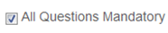

.. _feedback:
.. |Admin| image:: _static/admin_button.png
.. |Delete-Button| image:: _static/usr_del_tab.png
.. |Edit-Button| image:: _static/usr_edit_tab.png
.. |User-Details| image:: _static/usr_det_tab.png

**Feedback**
***********
•	Feedback forms can be used independently or in association with online courses/ classroom trainings.
•	The administrator can perform events like creating the feedback, editing feedback, viewing feedback details and publishing the feedbacks.
•	Feedback created can be integrated at both resource level and classroom training level.
•	After feedback is created, it is published as a resource for the users.
•	On user account, the feedback forms are added to the **My Training** tab.

*To access feedbacks:*

    Click |Admin| **Admin > Feedback**.

    .. image:: _static/feed_form.png

*There are 3 types of feedbacks:*

    1.	**Training Feedback**
    2.	**Trainers Feedback**
    3.	**Participant Feedback**

*Procedure to create feedbacks:*

    •	**Step 1:** Create Feedback Answer Type.
    •	**Step 2:** Create Feedback Category.
    •	**Step 3:** Create Feedback Form.
    •	**Step 4:** Create Feedback Form Questions.
    •	**Step 5:** Feedback Answer Type and the Category is mapped to Feedback From Questions.
    •	**Step 6:** Publish Feedback Form Questions as resources to the user groups.

**Feedback Answer Types**
=======================
    •	The feedback answer types is created with the *maximum scale*, ranging from 2 to 10 and then map it to the **feedback forms > questions > new questions**.
    •	Feedback answer types can be created, edited, deleted and also view details on the feedback answer types.
    •	*The feedback answer types can be any of the following:*

        | 1.	**Yes/No:**  Type yes/no question text. Define the correct answer. Feedbacks can be added that are displayed to users after submitting the answer.
        | 2.	**True/False:**  Type true/false question text. Define the correct answer. Feedbacks can be added similar to Yes/No questions.
        | 3.	**Multiple Choice Questions Single Answers:** This option allows users to select one answer choice from a list of choices.

*To access feedback answer types:*

    Click **Feedback > Feedback Answer Type**. The following **Manage Feedback Answer Types** screen appears displaying details on answer types.

    .. image:: _static/feed_ans_type.png
       :height: 250px
       :width: 500 px
       :scale: 120 %
       :align: center
**Create New Answer Type**
-------------------------
*To create answer type:*

    Click **Create New**. The following **Create Answer Type** screen appears with the respective details to be filled.

    .. image:: _static/crt_feed_ans_type.png
       :height: 350px
       :width: 500 px
       :scale: 120 %
       :align: center

.. note:: •	The *Answer Type* field must be a string with a maximum allowed length of 36 characters.
  •	The MaxScale field:
       1.	Provides a range of answer type options for the multiple choice questions single answer, at the scale 2 to 10.
       2.	The *Special Type* option is used only for the descriptive type of questions.

**Edit, Delete and View Answer Type Details**
---------------------------------------------
*To edit answer type:*

    Click **Edit** |Edit-Button|. The **Edit Answer Type** screen appears with the chosen fields to be edited.

*To delete answer type:*

    Click **Delete** |Delete-Button|. An alert box is displayed with the following message: *“Do you want to delete the Feedback Answer Type?”*, click Ok or Cancel.
.. note:: Answer types cannot be deleted, if it is assigned with dependency. *For example*, if answer types are mapped to the feedback form questions, then it cannot be deleted.

*To view answer type details:*

    Click **Details** |User-Details|. The **Details** screen appears, displaying details of the answer type. The screen also provides with the option to **Edit** the details if required.

**Feedback Category**
===================
•	The feedbacks are classified into various categories like *Training Feedback, Trainer Feedback and Participant Feedbacks*.
•	The feedback category created is mapped to the feedback form *new questions*.
•	The categories can be created, edited, deleted and details on feedback categories can be viewed such as *Category Code and Category Name* for the trainings.

*To access feedback category:*

    Click **Feedback > Feedback Category**. The following **Manage Feedback Categories** screen appears displaying category details.

       .. image:: _static/mng_feed_catg.png
          :height: 250px
          :width: 500 px
          :scale: 120 %
          :align: center

**Create Feedback Category**
-------------------------
*To create feedback category:*

    Click **Create New**. The following **Create Feedback Category** screen appears with the respective details to be filled.

          .. image:: _static/crt_feed_catg.png
             :height: 350px
             :width: 500 px
             :scale: 120 %
             :align: center

**Edit, Delete and View Category Details**
----------------------------------------
*To edit feedback category:*

    Click **Edit** |Edit-Button|. The **Edit Category** screen appears with the chosen fields to be edited.

*To delete feedback category:*

    Click **Delete** |Delete-Button|. An alert box is displayed with the following message: *“Do you want to delete the Feedback Category Name of Feedback Category?”* click Ok or Cancel.
.. note:: Feedback category cannot be deleted, if it is assigned with dependency. *For example*, if feedback categories are mapped to feedback form questions, then it cannot be deleted.

*To view feedback category details:*

    Click **Details** |User-Details|. The **Details** screen appears, displaying details on feedback categories. The screen also provides with the option to **Edit** the details if required.

**Feedback Form**
================
•	Feedback form is created based on the mapped *Feedback Answer Types* and *Feedback Categories*.
•	The feedback forms can be created, edited, deleted, create feedback form questions, publish the questions as resources, view feedback reports and the details on feedback forms can be viewed as *Form Code and Form Name* for the trainings.

*To access feedback form:*

    Click **Feedback > Feedback Form**. The following **Manage Feedback Forms** screen appears displaying details on feedback forms codes and names.

    .. image:: _static/mng_feed_forms.png
       :height: 350px
       :width: 500 px
       :scale: 120 %
       :align: center

**Create Feedback Form**
------------------------
*To create feedback form:*

    Click **Create New**. The following **Create Feedback Form** screen appears with the respective details to be filled.

       .. image:: _static/crt_feed_form.png
          :height: 350px
          :width: 500 px
          :scale: 120 %
          :align: center

.. note:: |All-Ques-Mandatory| checked, the feedback form questions must be answered mandatorily by the users.

**Create Feedback Form Questions**
---------------------------------
*To access feedback forms questions:*

    Click **Questions**. The following **Manage Questions** screen appears displaying details on feedback form questions.

          .. image:: _static/feedback_ques.png
             :height: 350px
             :width: 500 px
             :scale: 120 %
             :align: center

*To create feedback forms questions:*

    Click **Create New**. The following **Create Feedback Questions** screen appears with the respective details to be filled.

    .. image:: _static/crt_feed_ques.png
       :height: 350px
       :width: 500 px
       :scale: 120 %
       :align: center
.. note:: *Category Name* and *Answer Type* fields are mapped to the feedback answer type and feedback category.

*To edit feedback forms questions:*

    Click **Edit** |Edit-Button|. The Edit screen appears with the chosen fields to be edited.

*To delete feedback forms questions:*

    Click **Delete** |Delete-Button|. An alert box is displayed with the following message: *“Do you want to delete the question Name of the Questions?”* click Ok or Cancel.
.. note:: Feedback form questions cannot be deleted, if it is assigned with dependency. *For example*, if feedback forms questions are mapped to the classroom trainings, then it cannot be deleted.

**Publish Feedback Forms**
=========================
When feedback form questions are created, it is published as resources to the users' as an online resource feedback or as a classroom training feedback.

*To publish:*

    Click **Publish**. The following **Publish Feedback Form** screen appears.

    .. image:: _static/publish_feed_form.png
       :height: 350px
       :width: 500 px
       :scale: 120 %
       :align: center

.. important:: 1.	After feedback form is published, it will be added as a e-learning resources.
  2.	The e-learning resources must then be published to the :ref:`user groups <group users>`.
  3.	**On user accounts:**
      | •	*Online resources feedback* will be listed under :ref:`Available Courses <accessing elearning courses>` tab, from where the users must add and play the resources.
      | •	*Classroom training feedback* will be available to the users for the enrolled trainings under *My Training > Feedback*.

**Feedback Reports**
===================
The feedback report displays the details of the users who has given the feedbacks irrespective of the classroom training or the online resources.

*To view feedback report:*

    Click **Feedback Report**. The following **Feedback Report** screen appears displaying details on the username and average scale details.

    .. image:: _static/feed_rep.png
       :height: 350px
       :width: 500 px
       :scale: 120 %
       :align: center

*To view feedback report details:*

    Click **Details**  |User-Details|. The **Feedback Report Details** screen appears displaying details on the feedback report of the respective users.

**Edit, Delete and View Feedback Forms Details**
------------------------------------------------
*To edit feedback forms:*

    Click **Edit** |Edit-Button|. The **Edit** screen appears with the chosen fields to be edited.

*To delete feedback forms:*

    Click **Delete** |Delete-Button|. An alert box is displayed with the following message: *“Do you want to delete the Training Type Feedback Form Name?”* click Ok or Cancel.
.. note:: Feedback forms cannot be deleted, if it is assigned with dependency. *For example*, if feedback forms are published as a resource, then it cannot be deleted.

*To view feedback forms details:*

    Click **Details** |User-Details|. The **Details** screen appears displaying details on feedback forms. The screen also provides with the option to **Edit** the details if required.

**Import Feedback Form**
=======================
Multiple feedback forms can be imported, by uploading it in a bulk. Refer :ref:`Bulk Uploading Process <bulk users upload>` under *Import Bulk Users*.

**View Feedbacks**
================
    Click **Dashboard > Feedback**. The following **Feedback** screen appears displaying details on the feedbacks.

    .. image:: _static/view_feedback.png
