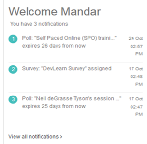

.. _notification:

**Notifications**
^^^^^^^^^^^^^^^^^^
* The notification displays all the latest **surveys, polls, classroom training feedbacks, trainer feedbacks** and **needbased trainings (Adhoc)** on the user home page.
* The **pre/post-assessments** is also displayed in the notifications, after the administrator/ trainer takes the user attendance.

*To access:*

    Click **Dashboard > Notifications.**

