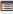

.. _survey:
.. |Admin| image:: _static/admin_button.png

.. |Edit-Button| image:: _static/usr_edit_tab.png

.. |Usage-Button| image:: _static/usage_button.png

**Surveys**
=========
* The survey is a method of collecting measurable information on the subjects based on population inputs.
* The administrator can *create surveys, edit survey, view survey details and publish the survey details* to the user groups.
* The survey created can appear at any time and do not have any start and end *Date & Time*.

  .. image:: _static/survey_menu.png

**Procedure to Create Surveys:**

  | * **Step 1:** Create new survey.
  | * **Step 2:** Assign survey's to user groups.
  | * **Step 3:** Create or manage the survey questions.
  | * **Step 4:** View users survey usage reports.

*To access the survey:*

    Click |Admin| **Admin > Manage Surveys**. The following **Surveys** screen appears displaying survey details.

    .. image:: _static/survey.png
     :height: 250px
     :width: 500 px
     :scale: 120 %
     :align: center

**Create New Survey**
^^^^^^^^^^^^^^^^^^
*To create survey:*

     Click **Create New**. The following **Create Survey** screen appears with the respective details to be filled.

     .. image:: _static/crt_survey.png
      :height: 250px
      :width: 500 px
      :scale: 120 %
      :align: center
.. note:: •	The :ref:`user groups <group users>` list users in a particular group, to which the surveys are mapped.
  •	*Max no. of participating user* field, specifies the maximum number of users who can participate in the survey from the assigned user groups.
  •	After user gives response to the particular survey, it will not be available again for that particular user.
  •	Mail's are sent to every users of the selected user group.

**Manage Questions**
^^^^^^^^^^^^^^^^^
When a new survey is created, new questions are also created for the selected survey type.

*To manage survey questions:*

    Click **Manage Questions** |User-Details|. The following **Manage Questions** screen appears displaying details on the survey questions.

    .. image:: _static/survey_ques.png
     :height: 250px
     :width: 500 px
     :scale: 120 %
     :align: center

*To create survey questions:*

     Click **Create New**. The following **Create Questions** screen appears with the respective details to be filled.

     .. image:: _static/crt_sury_ques.png
      :height: 250px
      :width: 500 px
      :scale: 120 %
      :align: center
.. note:: - The question types are displayed in the dropdown lists as given below:
                | o	**Yes/No:** Type yes/no question text. Define the correct answer. Feedbacks can be added that will be displayed to users after submitting the answer.
                | o	**True/False:** Type true/false question text. Define the correct answer. Feedbacks can be added that will be displayed to users after submitting the answer.
                | o	**Multiple Choice Questions Single Answers:** This option allows users to select one answer choice from a list of choices.
                | o	**Multiple Choice Questions Multiple Answers:** This option allows users to select one or more answer choices from a list of choices.
                | o	**Fill-in-the Blanks:** This option involves sentences, phrases or paragraphs with blank space provided to fill in the missing word or words.
                | o	**Likert Scale:** This option measures the survey actions, while creating the survey by using a comparable scale. It consists of answer choices that can be changed according to the scale settings.

**Edit and Delete Survey Questions**
^^^^^^^^^^^^^^^^^^^^^^^^^^^^^^^^^^
*To edit survey question:*

    Click **Edit** |Edit-Button|. The **Edit Questions** screen appears with the chosen fields to be edited.
.. note:: Multiple user groups can be added while editing and mail notifications can be sent to all the users under the particular group.

*To delete survey questions:*

    Click **Delete** |Delete-Button|.  An alert box is displayed with the following message: *“Do you want to delete Survey Question?”*, click Ok or Cancel.
.. note:: Survey questions cannot be deleted, if the user has already participated in the survey and given the response.

**Import Survey Questions**
^^^^^^^^^^^^^^^^^^^^^^^^
The survey questions can be uploaded in a bulk. Refer :ref:`Steps to Import Questions <assessment>` under *Assessments*.

**Edit, Delete and View Survey Details**
^^^^^^^^^^^^^^^^^^^^^^^^^^^^^^^^^^^^^
*To edit survey:*

    Click **Edit** |Edit-Button|. The **Edit Survey** screen appears with the chosen fields to be edited.

*To delete survey:*

    | * Click **Delete** |Delete-Button|.
    | * *The deletion can be done based on two scenarios:*

          | •	**Scenario 1:** *Delete Before User Participation of Survey:* The survey can be deleted only before the user participations; i.e. if the user does not participate in the particular survey. The survey can be removed, by deleting all the questions under the particular survey first and then only can the survey be deleted.
          | •	**Scenario 2:** *Delete After User Participation of Survey:* The survey cannot be deleted after the user participates in the particular survey.

*To view survey details:*

    | •	Displays details related to the surveys.
    | •	Click **Details** |User-Details|. The **Survey Details** screen appears displaying survey details.

**Usage**
^^^^^^^
The usage displays, the response percentage of the users in a particular survey conducted.

*To display usage details:*

    Click **Usage** |Usage-Button|. The following **Survey on <survey name>: Usage** screen appears displaying details.

    .. image:: _static/survey_usage.png
     :height: 250px
     :width: 500 px
     :scale: 120 %
     :align: center

*To export usage report:*

     Click **Export to Excel**. The survey usage report can be exported to excel in .csv file format.

**Import Survey**
^^^^^^^^^^^^^^
Multiple surveys can be uploaded in a bulk. Refer :ref:`Bulk Uploading Process <bulk users upload>` under *User Groups*.

**Participate in Surveys**
^^^^^^^^^^^^^^^^^^^^^^^^^^^
•	Users can take part in the survey by providing responses to the survey published.
•	Survey is not available again to the user's once the response is given.

**Steps to Participate in Survey:**
----------------------------------
    | * **Step 1:** Click **Dashboard > Survey**. The following **Surveys** screen appears displaying a list of published surveys.

        .. image:: _static/user_survey_participate.png

    | * **Step 2:** Finally click the respecitve survey.
