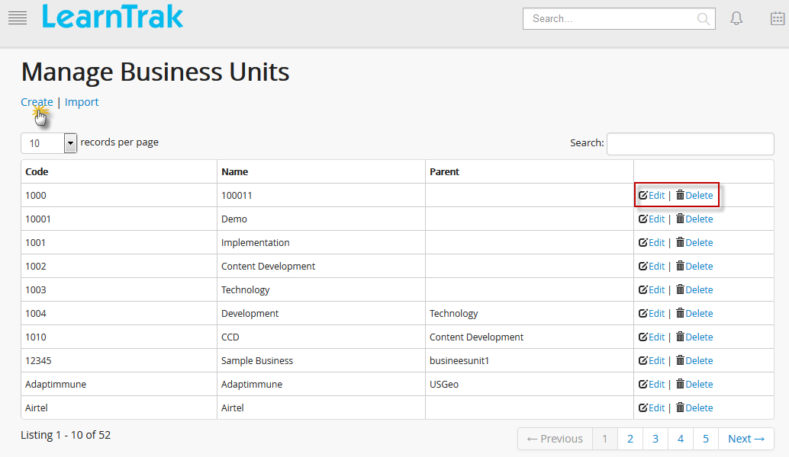
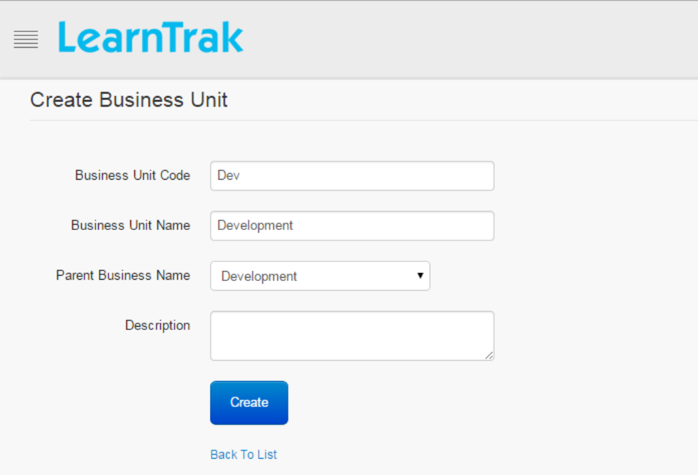
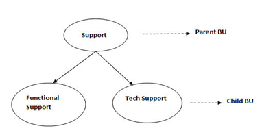
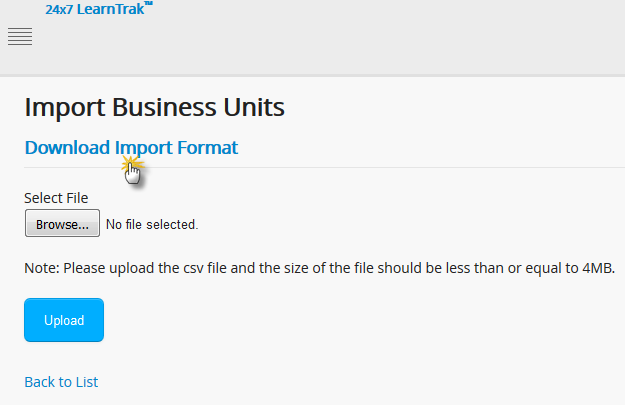

.. _business-units:
.. |Admin| image:: _static/admin_button.png
.. |Delete-Button| image:: _static/usr_del_tab.png
.. |Edit-Button| image:: _static/usr_edit_tab.png

**Business Units**
******************
* The LMS business units is nested into a hierarchy of business units to form the logical business unit. The users within the hierarchy represent the parent-child relationship. The BU hierarchy structure is independent of another business unit structure.
* The information flows in a top-down approach, where the top-level BU Admin has the right to access information's of bottom-level BU Admin i.e., information of all individual users or group users. The LMS allows creation of multiple users under each business unit which is based on parent-child relationship hierarchy.

  **LearnTrak-LMS Business Unit Hierarchy Flow:**

  .. image:: _static/bu_hierarchy.png
     :height: 350px
     :width: 500 px
     :scale: 110 %

**Creating Business Units**
============================
The business unit created are tenant specific, i.e., each tenant can have different business units. The *System/Super Admin* has the right to create business units based on the parent-child relationship which is mapped to single user or group users. The business units can be created, edited and deleted.

.. note:: In LMS, the normal BU Admin is not given the rights to create the business units, as it remain only with the *System Admin*.

*To access BU module:*

  1.	Click |Admin| **Admin > Manage Users > Manage Business Units**. The following **Manage Business Units** screen appears.

*To create business units:*

  2.	Click **Create**. The following **Create Business Unit** screen appears consisting of the following fields, namely:
      •	Business Unit Code (Alphanumeric)
      •	Business Unit Name
      •	Parent Business Name
      •	Description (if any)

.. important:: - The new **Business Unit Name** created becomes the child BU under the **Parent Business Unit Name**. Parent BU is not mandatory and when not selected, the new *Business Unit Name* becomes the parent BU.
  - The *BU Admin* at the top-level has the rights to create, edit and delete information of all its users at the low-level. A BU Admin at the bottom-level can only view details created by its top-level administrator.
  - Child BU Admin of the particular business unit can be changed at any time by its parent BU Admin.
    **Example:**  Human Resources, Sales & Marketing and Productions etc, are some of the classic examples of business units.

**Edit and Delete Business Units**
================================
The business units can be edited and deleted by the BU administrator only.

* *To edit business unit:*
    Click **Edit** |Edit-Button|. The **Edit Business Unit** screen appears with the chosen fields to be edited.

* *To delete business unit:*
    Click **Delete** |Delete-Button|. It deletes the selected business unit.

.. note:: Business unit cannot be deleted, if is assigned with any dependency. *For example*, if the users are mapped to a particular business unit, then it cannot be deleted.

**Import Business Units**
==========================
* The business units is :ref:`uploaded in bulk <bulk users upload>` by importing it via **.csv file**. The .csv file size should be less than or equal to 4MB.
* Click **Import**. The following **Import Business Units** screen appears.

