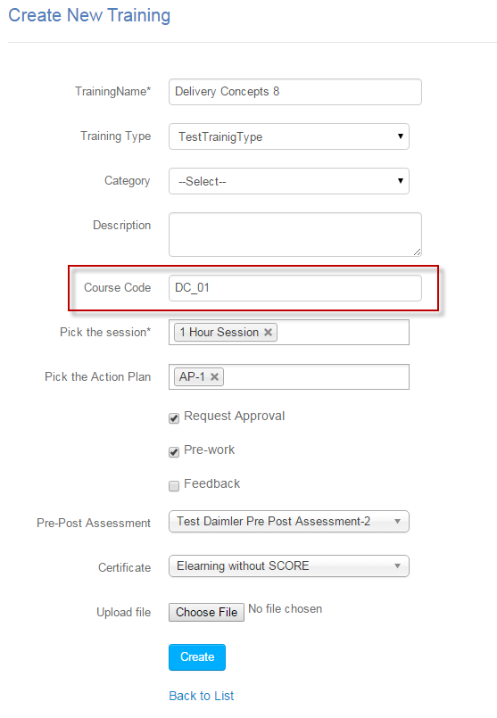

.. _direct_url_training_access:
.. |Click-Button| image:: _static/click_button.png
.. |User-Details| image:: _static/usr_det_tab.png

**Direct access to Classroom Trainings**
********************************************
* The :ref:`classroom trainings <new training>` can be accessed directly via *URL*.
* For accessing the training directly, the administrator must provide unique **Course Code** to the newly created training.

.. note:: The *Course Code* is a unique alpha-numeric code.
* The newly created training is then published to the :ref:`user groups <group users>`.
* An email is sent to the respective users with *text link*, to access the trainings directly.

    *Example:* http://learntrak.com/classroom/tw_01
* **On user account:**
      | * The user receives the mail with a URL to launch the training directly.
      | * On clicking the link the user will be directed to **Training Details** screen, from where the user must |Click-Button| **Add** the training.

          .. image:: _static/training_search_add.png
             :height: 350px
             :width: 500 px
             :scale: 200 %
             :align: center

      | * This screen displays the training details such as *name, description, date and location* along with the :ref:`user status <new instance>`.
      | * The users for whom the training is not published, only |User-Details| **Details** will be available.
      | * The details screen displays training information such as the *training name, start & end date, location, session, trainer name, room name and actions*.
