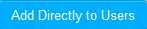

.. _publish training:
.. |Add-User| image:: _static/add_user.png

**Publish Training**
==================
•	The new instances created for a particular training is published to the user groups.
•	On user account, the published training will be displayed under **Available Trainings** tab, from where the users must add the trainings to his/her training plan.
•	Once the training is added, it will then list under **My Trainings** tab, from where the users must self-nominate and attend the training.

*To publish trainings:*

  •	Click **Publish**. It is redirected to **Training Name <sample_name>** screen.
  •	The administrator must select and add the user group(s) from *Not Published* list to the *Published* list.
  •	Click |Add-User| (or) |Add-User-Directly| to add the training(s) to the selected user group(s).

.. note:: | o	If the training is of request approval type, then the user must get approval from the *administrator or reporting manager* to attend the training.
  | o	**Add Directly to Users:** The selected training(s) is added directly to the users by clicking the *Add Directly to Users* button.
  | o The aim of this functionality is to allow all the published trainings to be directly listed under **My Trainings** tab instead of **Available Trainings** tab.
  | o	The following **Users** screen appears to select and nominate the users to the training instances.

      .. image:: _static/add_users_direct.png
         :height: 350px
         :width: 500 px
         :scale: 120 %
         :align: center

   | o	The screen displays details like the *Total Goup Users, Total Availability, Total Enrolled Users and Current Availability*.

        | - *Total Group Users* lists the total number of users from the selected group(s).
        | - *Total Availability* lists maximum available nominations.
        | - *Total Enrolled Users* list number of confirmed users.
        | - *Current Availability* lists latest nominations that are in use.
        | - To assign a single user or multiple users to the training, check the *Select All* option.
        | - To assign users randomly to the training, check the *Automatic Process* option.

              | * The users are randomly assigned to the training depending on the *current availability* count.
              | * The next set of users **(Maximum Nominations * 2)** is in the waiting list.
              | * Finally, the remaining users are assigned to the next set of training instances.

   | o	Click |Add-User|.
   | o	After adding the training(s) to the user group(s), it appears directly under **Classroom > Training > My Training** tab at user account.
   | o	The request approval type training(s) are also listed under **My Training** tab. On approval from the reporting manager/administrator the users are enrolled for the trainings.
   | o	The users and the respective training log details will be listed in the **Audit Logs**.
