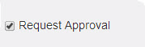

.. _request approval type training:
.. |Edit-Button| image:: _static/usr_edit_tab.png
.. |Classroom-Training| image:: _static/class_button.png

**Request Approval Type Classroom Trainings**
********************************************

•	Trainings with request approvals are normally termed as private trainings which require approval from :ref:`reporting manager <reporting manager>` or administrator for the users to attend the trainings.
.. note:: The reporting manager is also an administrator who has the rights to approve/reject requests for online resources and programs.
•	*The process of accessing private trainings is similar to the normal trainings:*

    | o	**Step 1:** Create new trainings with request approval.
    | o	**Step 2:** Create new instances.
    | o	**Step 3:** Publish trainings to the user groups.
    | o	**Step 4:** Request approval is sent to the reporting manager or administrator.

                       | - On the reporting manager’s account, request approval trainings are listed under **My Approvals** tab.

                       | - The reporting manager or administrator receives mail on the same.

                       | - *To approve:* Click |Classroom-Training| **Classroom > My Approvals**. The **My Approvals** screen appears displaying, a list of users and trainings to be approved or rejected.

                       | - If the training request is approved by the reporting manager, it appears in respective users account under *My Training* list, from where the user can access the trainings.

                       | - If the user is not assigned to a reporting manager, then the administrator must assign it by updating the user’s reporting manager detail under **Users > Manage Users >** |Edit-Button| **Edit**.

                       | - The request approval trainings published, are also available for the reporting manager as he/she is also a user.

   | o	**Step 6:** Take users attendance.
   | o	**Step 7:** Give the feedbacks.
   | o	**Step 8:** Fill the action plan details.
