.. _training access:
.. |Classroom-Button| image:: _static/class_button.png
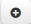
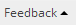
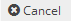
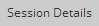
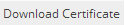
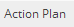
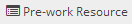
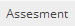
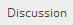
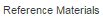

**Accessing the Classroom Trainings**
*************************************
* The *trainings* tab displays list of classroom trainings allocated to the users.
* The users can attend the trainings by adding it to his/her training plan.
* The trainings tab is available to all the users such as *root administrator, administrators, system administrator*, :ref:`reporting manager <reporting manager>`, :ref:`trainers <trainer>` and :ref:`learners <users>`.
* The classroom trainings assigned to the users are available at |Classroom-Button| **Classroom > Trainings** tab under the *menu bar*, which displays list of allocated classroom trainings.

* *Classroom trainings can be classified into 2 types:*

    | I. **General trainings**
    | II.	**Request approval trainings**

* *To access training:*

      Click |Classroom-Button| **Classroom >** click **Trainings**. The **Classroom** screen consists of the following four modules:

        | 1.	**My Training**
        | 2.	**Available Training**
        | 3.	**Team Trainings**
        | 4.	**Company Trainings**

* *The administrator can view the training details in 2 ways:*

    * .. image:: _static/cal_view.png
    * .. image:: _static/list_view.png

.. note:: Classroom trainings can be filtered based on the categories that are selected from dropdown lists.

**Available Training**
=====================
•	The *available training* tab displays a list of classroom trainings published to the users.
•	The trainings available are viewed as either *List or Calendar* based on month, week or day.
•	The users must click |Click-Button|, to add the respective trainings to the training plan.

 	.. note:: If the training is of request approval type, then a request is sent to the reporting manager/administrator for the training approval.
•	The added trainings will be listed under *My Trainings* tab.

 	.. note:: The request approval type trainings once approved will be listed under this tab.
•	This tab is available to all the users such as *super administrator, administrator, system administrator, reporting manager, trainer and learners*.

*To access available training:*

    Click **Available Training** tab > **Calendar View | List View**.

    .. image:: _static/available_training.png
     :height: 350px
     :width: 500 px
     :scale: 120 %
     :align: center

*To add training:*

    **Calendar View | List View** > click **Add to Training**.

    .. image:: _static/available_list_view.png
     :height: 250px
     :width: 500 px
     :scale: 120 %
     :align: center

**My Training**
==============
•	The user nominates to the training by adding it from *Available Trainings tab* to *My Training tab*.
•	The *My Training* tab lists users enrolled and ready to attend the trainings.
•	The trainings available are viewed as either *List or Calendar* based on month, week or day.
•	The trainings can be filtered based on categories.
•	This is available to all users such as *super administrator, administrator, system administrator, reporting manager, trainer and learners*.

*To access my training:*

    Click **My Training** tab > **Calendar View | List View**.

*The trainings listed are divided into 6 states:*

    * .. image:: _static/confirmed_tab.png
    * .. image:: _static/notconfirmed_tab.png
    * .. image:: _static/waitinglist_tab.png
    * .. image:: _static/attended_tab.png
    * .. image:: _static/notattended_tab.png
    * .. image:: _static/app_requested_tab.png

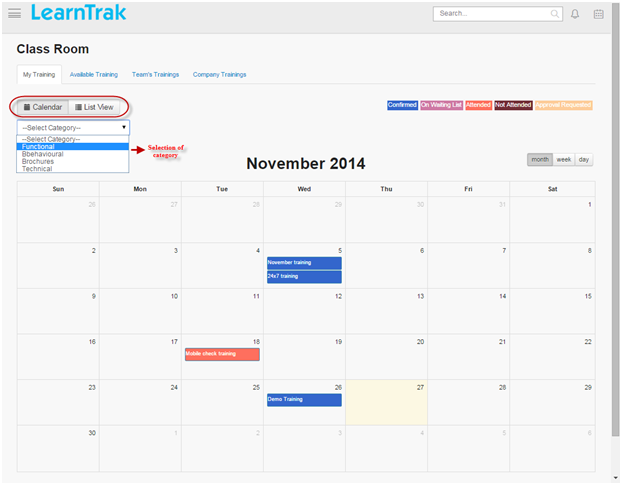

•	When the user completes training program the users must provide the following details listed under the *List View* tab:

    | - |Feedback-Tab|: The user must provide feedbacks on trainers, trainings and can view participant’s feedback.
    | - |Cancel-Tab|: Users not attending the trainings can cancel the training nominations.
    | - |Session-Tab|: It displays *WebEx session* details for the users.
    | - |Download-Tab|: Users can download the course completion certificate for *SCORM, AICC, xAPI* courses and the *classroom trainings*.
    | - |Action-Plan|: Users can provide the *action plan* details for classroom trainings.
    | - |Prework-Tab|: It allows users to upload the pre-work resources and also displays any resources uploaded by the administrator.
    | - |Assessment-Tab|:

                         | o **Pre-test Assessments:** The pre-test can be accessed before the training starts.
                         | o **Post-test Assessments:** The post-test can be accessed after the training is completed.
    | - |Discussion-Tab|: Users can participate in discussion forums on the classroom trainings and the post replies.
    | - |Referemce-Material-Tab|: Users can download the *reference materials* related to the classroom training.

.. note:: - The *pre-work resources, Assessment and Discussion* tabs appears before the training starts.
  - The user will receive mail notifications for the pre-post assessments/ feedbacks attached as a text link to the training.

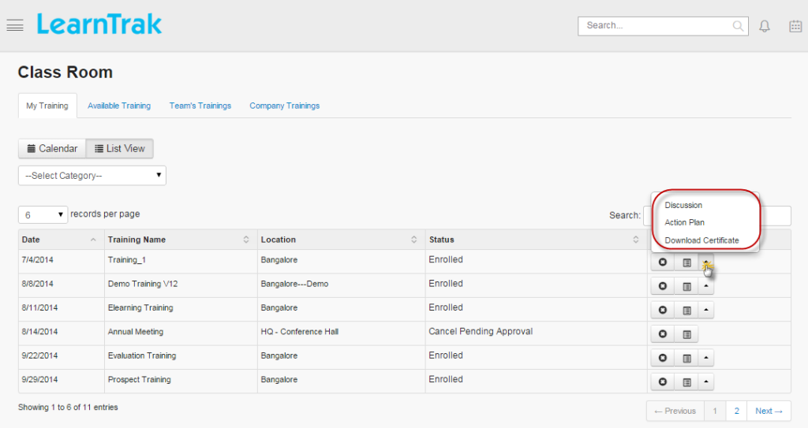

**Team Trainings**
=================
•	The *team trainings* tab, is displayed only for reporting manager and administrator who can also play the role of a *reporting manager*, but this tab does not display for the *trainers and learners*.
•	It displays respective training programs published to all its reportees.
•	The confirmed user’s training details under particular training program along with their user status are displayed.
•	If any of the confirmed users does not report to their reporting manager, then such user’s training details will not available to the reporting manager.
.. note:: Refer to :ref:`Types of User Status <new instance>` for further informations.

*To access team trainings:*

    Click **Team Trainings** tab > **Calendar View | List View**.

    .. image:: _static/team_training.png
       :height: 350px
       :width: 500 px
       :scale: 120 %
       :align: center

**Company Trainings**
===================
•	The *company trainings* tab, displays entire training programs conducted by the company in the current month.
•	The non-nominated users can nominate themselves by adding the training programs to his/her training plan.
•	This tab is available to all the users such as *super administrator, administrator, system administrator, reporting manager, trainer and learners*.

*To access company trainings:*

    Click **Company Training** tab > **Calendar View | List View**.

    .. image:: _static/company_training.png
       :height: 350px
       :width: 500 px
       :scale: 120 %
       :align: center

**My Action Plans**
===================
* The action plan task assigned to the user by the reporting manager wil be listed under this tab.
* The user must provide reviews on the assigned action plan task.
.. note:: A mail notifications is sent to the reporting nanager on the completed action plan task.
* The reviewed action plan task details is sent to the reporting manager/ supervisor.

**My Training Cost**
===================
* The :ref:`training cost <new instance>` displays the total cost on each classroom trainings enrolled by the user.
* The training cost screen displays the cost details for the attended and not-attended classroom trainings by the user.

*To access training cost:*

    | * Click |Classroom-Button| **Classroom > Training Cost**. The following **Training Cost Details** screen appears as shown.
    | * Click **Export to Excel** to export the training cost details to .csv file.

    .. image:: _static/user_training_cost.png
       :height: 250px
       :width: 500 px
       :scale: 150 %
       :align: center

**My Approvals**
================
•	Every reportees classroom training request is displayed under *My Approvals* tab.
•	The approval level depends on the tenant settings.
•	LMS supports :ref:`two-level of approvals <approvals>` under each business units.
•	Only the **administrator** and **reporting managers** have access to the **My Approvals** tab.

*To view approvals:*

    Click |Classroom-Button| **Classroom > My Approvals**. The following **My Approvals** screen appears displaying a list of trainings to be approved or rejected by the reporting manager/administrator.

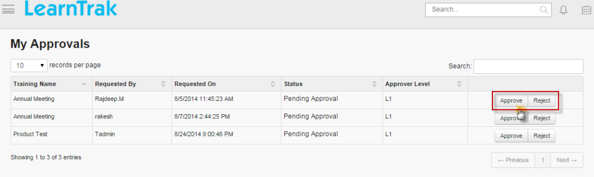

.. note:: •	The reporting manager will receive mails regarding the request approval/rejection for the training programs from its reportees.
    •	The users will also receive mail when the reporting manager approves or rejects the training programs.
