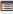

.. _user attendance:
.. |Take-Attendance| image:: _static/tk_at_button.png

**Take User Attendance**
=======================
•	The take attendance screen displays list of enrolled users for the particular classroom training.
•	When the training session starts, the administrator/ trainer must take the attendance of the users for the classroom training.
•	Once attendance is taken the respective training cannot be cancelled.
.. note:: The attendance of users is always taken based on the number of iterations.

*To take user attendance:*

    Click **Take Attendance** |Take-Attendance|. The following **Take Attendance** screen appears displaying the details.

    .. image:: _static/take_attendence.png
       :height: 250px
       :width: 500 px
       :scale: 120 %
       :align: center

**View Attendance Details**
---------------------------
The view attendance details, display information’s of users who attended and present for the classroom trainings.

*To view attendance details:*

    Click **Attendance Details** |User-Details|. The following **Attendance Details** screen appears displaying the details.

    .. image:: _static/view_attendance.png
       :height: 250px
       :width: 500 px
       :scale: 120 %
       :align: center

**Session Details**
------------------
The session details display information’s on particular classroom training such as the *session name, sessions date & time, session trainer, room layout* used for the particular classroom trainings.

*To view session details:*

  | •	Click **Session Details**. A pop-up screen appears displaying the session details.
  | •	Details on *WebEx sessions* hosted by the administrator and attended by the user’s are also displayed.

  .. image:: _static/session_details.png
     :height: 250px
     :width: 500 px
     :scale: 120 %
     :align: center
