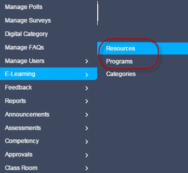

.. _elearning:

**Introduction to E-Learning**
****************************
E-learning is referred to as electronic learning, where the learner using technology can learn skills or process and deliver training at anyplace, anytime. It is also called as online or web-based or computer-based training. E-learning is more effective than Instructor Led Training (classroom). It can be network-based, intranet-based or internet-based, CD-ROM-based and can include text, audio, animation, video and virtual environments.

**Advantages of E-Learning**
===========================
•	E-learning facilitates cost-effective learning and saves learners time.
•	E-learning provides opportunities for learners to study anywhere at any time by accessing computer or internet connections.
•	E-learning helps to track learners and instructors progress reports.
•	E-learning allows learners to learn at their own pace by providing interactive learning modules with the aim of understanding complete process.
•	E-learning allows learners to join forums, chat rooms and take online tests.

**Features of Online Learning**
==============================
•	**Resources:** It consists of programs, assessments, feedback, survey, polls created by the administrator.
•	**Publishing and Assigning Program/Resources:** Administrator can assign specific program/resources to users (individual/group users).
•	**Digital Library:** It consists of learning resources shared by users.
•	**Approvals:** It facilitates reporting manager and administrator to approve the request, raised by users for the private resources.
•	**Reports:** It consists of various progress reports for the administrator and users.

**Resources**
============
• The administrator can add, modify and view the resources.
• *The resources are of the following types:*

  | 1. :ref:`Online courses <online course>`

  | 2. :ref:`Online programs <online programs>`

  | 3. :ref:`Assessments <assessment>`

  | 4. :ref:`Feedback <feedback>`

  | 5. :ref:`Survey <survey>`

  | 6. :ref:`Polls <polls>`

