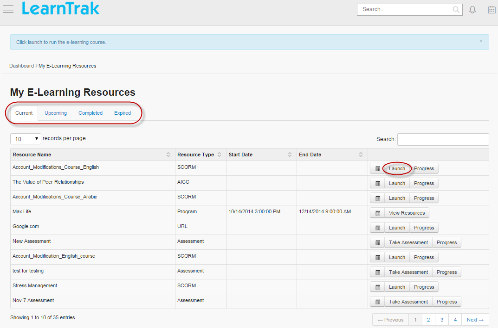
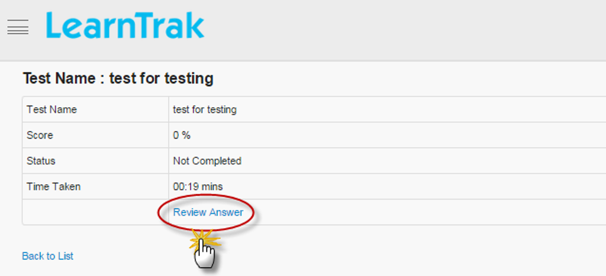
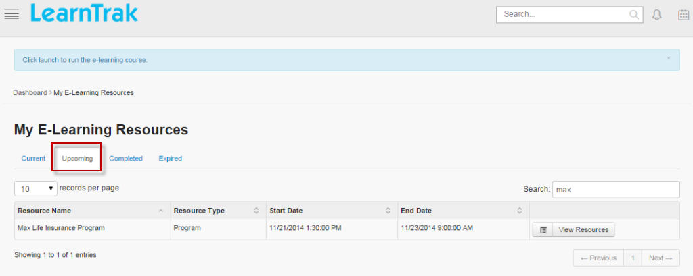
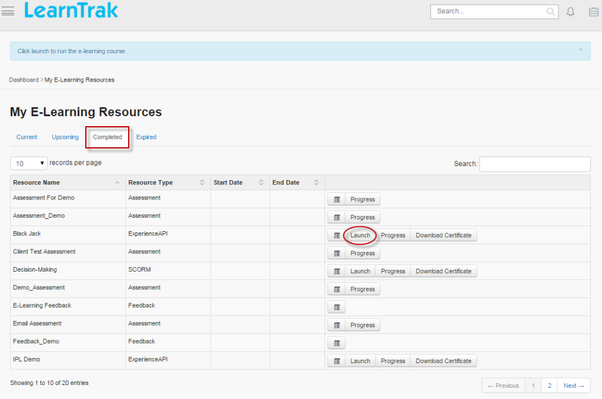
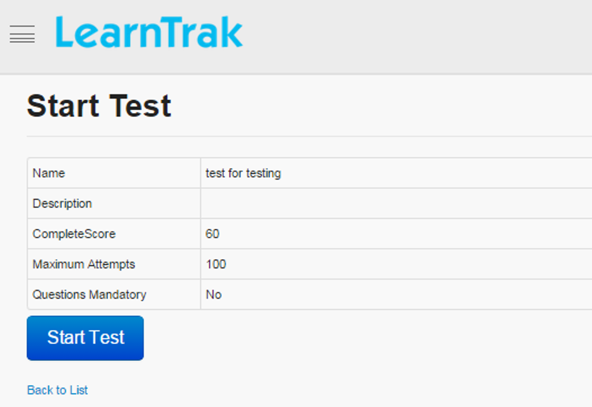
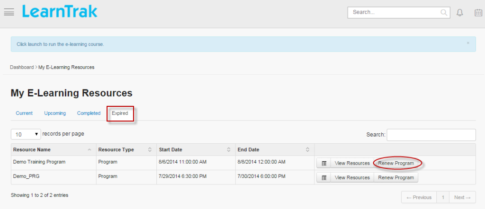

.. _accessing elearning courses:

**Accessing E-Learning Courses**
*******************************
The **E-Learning** module displays the online resources of type *Experience API, Documents, AICC, SCORM , Feedback, URL, Assessments, Videos and Online Programs* for the users.

- This module can be accessed, by clicking |E-Learning| **E-Learning** tab under the menu.
- *The e-learning tab is divided into following two sub-tabs:*

      1.	**My E-Learning Courses**
      2.	**Available E-Learning Courses**

- E-Learning resources is accessed directly under **Users Dashboard > Learning Feed >** |E-Learning1| **E-Learning**. It is then redirected to **My E-Learning Resources** screen which displays lists of e-learning resources.

- **Online Programs:**

    * Online programs are collections of online resources such as *Experience API, Documents, AICC, SCORM, Feedbacks, URL, Assessments and Videos* that are bundled together to form a single program and are accessed within set *Start and End* date & time.

    * The programs assigned appear under **My E-Learning Resources** screen **> Upcoming** tab, which is later listed under **Current** tab when the program set time equals to the server time.

**Available Courses**
===================
The resources published to the users such as the *Feedback, Document, URL, Assessments, Videos, Experience API, AICC and SCORM* courses are listed under **Available Courses** tab.

- *This tab is classified into 2 sub-tabs:*

      1. **E-learning Courses**: The e-learning standards AICC, SCORM and Experience API (xAPI) courses are listed under this tab.

      2. **Other Resources**: Resources like Documents, URL, Videos, Feedbacks and Assessments are listed under this tab.

-	Based on the categories the respective resources are displayed representing tree structure.
- Each parent category can have multiple child categories.
- The parent category displays total count of resources.

.. note:: If the parent category does not have any resources, then it will not be displayed.

- *To access available courses:*

    * Click |E-Learning| **E-Learning > Available E-Learning Courses** tab. The following Available **E-Learning Resources** screen appears as shown below.

      .. image:: _static/avil_res.png
         :height: 500px
         :width: 1000 px
         :scale: 70 %
         :align: center

    * Select the resources to be added > click **Add**.
    * Request approval type resources requires users to send the request to the administrator or the :ref:`reporting manager <reporting manager>`.
    * To send resources request > click **Send Request**.
    * Once resources request is approved by reporting manager the users can access it.
    * After resources are added from **Available Courses** tab, it will be listed under **My E-Learning Courses** tab, where the users can access the assigned courses.

**My E-Learning Activity**
========================
* The **My E-Learning courses** lists both e-learning resources and online programs under **Current** tab.

* Click **Launch** to play the course.

* The online programs published are listed directly under **My E-Learning Resources > Upcoming** tab.

* When the programs start time equals to system time, the program moves to **Current** tab where the user must launch it and complete it within the set date & time of the program completion.

* *To access my e-learning courses:*

  - Click  |E-Learning| **E-learning > My E-learning Resources** tab. The **E-learning Resources** screen appears.

**My E-Learning activity is divided into 4 tabs:**

  **1.	Current:**
    •	This tab displays resources and programs that is added recently.
    •	It displays programs with start date & time equal to server date & time.
    •	Click **Launch** to play the course.
    •	The **Progress** checks the progress report on the current course.
    •	The **Details** display resources and programs information that is assigned to the user.

.. important:: - The users can take the test as the *Assessments*.
 - Click **Take Assessment**.
 - When the test is completed the users have the option to review the test answers.
 - Click **Review Answer**. The following **Test Name: Name_of_the_assessment_test** screen appears as below.

**2.	Upcoming:**
   •	This tab displays future programs that have start date & time greater than the current date & time.
   •	The programs list under **Current** tab when start date-time equals to the current date & time.
   •	The programs published will be listed under this tab at the user account.

**3.	Completed:**
   •	The resources or programs that is completed are listed under the this tab.
   •	A program consisting of completed resources is also listed.
   •	Incomplete resources of completed program is listed, but it cannot be restored until all the resources of the program reach completed state.
   •	To restore programs or resources > click **Launch**.
   •	**View Resources** tab displays all the added resources of a particular program.
   •	Users can *Download Certificate* after completing the course.
   •	Users can view the **Progress** report of the completed course.
   •	Users can view **Details** of the competed course.

.. important:: **Retaking the Assessments:**

  - Users can retake assessments that has exceeded the maximum number of allowed attempts by sending request to retake the assessments to the administrator.
  - Under **Current** tab > click **Take Assessments**.
  - The following **Start Test** screen appears, click **Request for Re-attempt**.
  - The **Request for One More Attempt** pop-up screen appears to send the request to the administrator.

**4.	Elapsed:**
   •	This tab displays all the finished programs, where the start date & time and end date & time is less than the current system date & time.
   •	If the user needs to retake the expired program, it can be renewed by clicking **Renew Program**.
   •	Request approval or rejection must be sent to administrator for renewal of expired programs.

