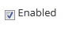

.. _enabled:

**Enabled**
==========

•	**Scenario 1: Administrator:**
  | o	All the resources are enabled by *Default*.
  | o	If particular resource is disabled, while publishing it to the users it does not appear in the **Not Added Resources** list under **Add/Remove Resource or Program** screen.
  | o	If disabled resources is already mapped to the users, then those resources will be listed in **Added Resources** list but it cannot be used.
  | o	The administrator cannot remove disabled resources that are already mapped to the users that are listed under **My E-Learning** courses.
•	**Scenario 2: Users:** On user account, the disabled resources mapped to the users will not be listed under :ref:`Available E-Learning Course <accessing elearning courses>` tab and the users cannot access these resources.
