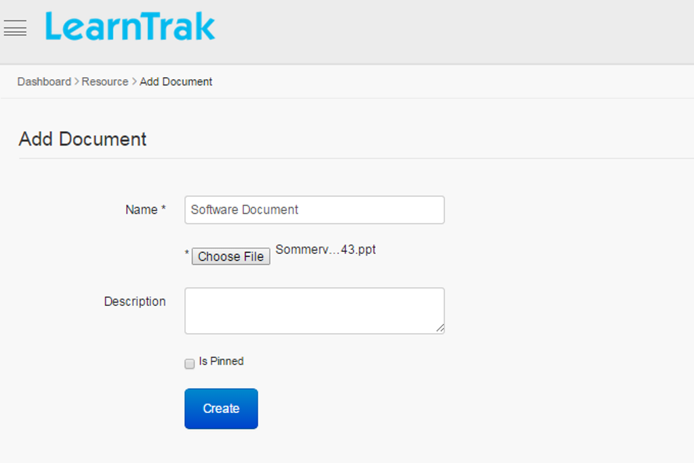

.. _online course:
.. |Admin-Button| image:: _static/admin_button.png
.. |Delete-Button| image:: _static/usr_del_tab.png
.. |User-Details| image:: _static/usr_det_tab.png

**Online Courses**
******************
Online courses can be taken by the students at any place at any time. It does not require students and instructors to be at the same place and still interact with one another via the internet. Online courses help students to interact with the instructors on a daily basis via emails, chats and discussion forums.

*The online courses are of 2 types:*

  | •	**General Online Courses**
  | •	**Request Approval Online Courses**

*To access online course:*

    | Click |Admin-Button| **Admin > E-Learning > Resources**. The following **Manage Resources** screen appears displaying lists of online resources.

*The online courses can be any of the following types:*

  | **. AICC Compliant**
  | **. SCORM Compliant**
  | **. Experience API (xAPI)**
  | **. URL**
  | **. Video**
  | **. Document**

**1) AICC Compliant**

•	The *Aviation Industry CBT (Computer-Based Training) Committee (AICC)* is an international association of technology-based training professionals.
•	The AICC develops guidelines for the development, delivery and evaluation of CBT and related training technologies. This is a standard to be followed while creating an e-learning course. This helps page-wise and score-wise tracking of the content, i.e. it can be bookmarked.
•	With AICC, the application server acts like a URL for the courses present at the content server and scores are found with the AICC.
•	The administrator can upload public or private AICC Compliant.

*To import AICC:*

    | Click **Import AICC**. The following **Import AICC** screen appears for AICC files to be uploaded in any of the following file type formats:

      •	**.au files (Audio)**
      •	**.crs files**
      •	**.des files**

.. note:: - The file upload size must be less than or equal to 30720 KB.
 - A *Single AICC or Multiple AICC* courses can be uploaded via zip files.
 - The URL is of type formats *.au files, .crs files and .des files*.

**2) SCORM Compliant**

•	*Sharable Content Object Reference Model (SCORM)* is also a collection of standards and specifications for the web based e-learning. This helps page-wise and score-wise tracking of the content, i.e. it can be bookmarked.
•	With SCORM 1.2, both the courses and contents are present at the same application server and the scores are found with the SCORM 1.2.
•	The administrator can upload the public or private SCORM 1.2 compliant.

*To import SCORM:*

    | Click **Import SCORM**. The following **Import SCORM** screen appears as shown below.

.. note:: - The SCORM 1.2 course must be uploaded via ZIP file.
 - :ref:`Portable <portable>` must be checked to import the SCORM 1.2 file. If not checked, then it can be done via the **Edit Portable** link.

*The SCORM courses can be imported in 2 ways:*

| **1.  SCORM course zip file:** Upload the SCORM 1.2 course content via ZIP file.
| **2.  Dropbox:** Only users holding the Dropbox account can use it.

              | * **Step 1:** The SCORM 1.2 course content must be first uploaded to the Dropbox file folder from the user’s local folder.
              | * **Step 2:** Then upload the course to the LMS.
              | * **Step 3:** Finally launch the SCORM 1.2 course.

**3) Experience API Compliant**

•	The *Experience API (xAPI)* is an open source API.
• It is also a type of resource where the users can play the course offline.
•	The Experience API is the advanced version of SCORM and it can be played on the mobile platforms.
•	The important feature of xAPI is that, it provides security and more contents.
•	The administrator can upload the public or private xAPI compliant.

*To add Experience API:*

    | Click **Add Experience API**. The following **Add Experience API** screen appears with the data fields to be filled.

.. image:: _static/add_xapi.png
   :height: 450px
   :width: 500 px
   :scale: 110 %
   :align: center
.. note:: - **Launch URL:** It is the course content path used to launch the XAPI course. *Example:* https://learntrak.s3.amazonaws.com/courses/golfxapi/index.html
  - **Activity ID:** It is the unique Id for the particular Launch Url. *Example:* http://tincanapi.com/GolfExample_TCAPI
  - :ref:`Portable <portable>` must be checked, and the **Portable URL** of the xAPI course ZIP file location must be given. If not checked, then it can be done using the **Edit Portable** link.

**4) Custom Content Type Compliant**

•	Custom Content Type courses are of types, *PPT/PDF/Word/Excel documents or URL* of an internet webpage.
•	With custom content type, the page-wise and score-wise tracking of the content cannot be done, i.e. it cannot be bookmarked.
•	The administrator can upload the public or private custom content type compliant.
•	*There are 3 types of Custom Content Type  (CCT) courses:*
    | * **CCT URL**
    | * **CCT Document**
    | * **CCT Video**

**To import Custom Content Type (CCT):**

*The Custom Content Type course can be imported in following 3 ways:*

**1.	To add Custom Content URL:**

                  | Click **Add URL**. The following **Add URL** screen appears with the data fields to be filled.

.. note:: - The *Launch URL*, for example: http://www.google.com.
 - The description field is optional (if any).

**2.	To add Custom Content Video:**

                  | Click **Add Video**. The following **Add Video** screen appears with the data fields to be filled.
                  .. image:: _static/add_video.png
                     :height: 350px
                     :width: 500 px
                     :scale: 110 %
                     :align: center
.. note:: - **Launch URL:** It is the course content path utilized to launch the video. *Example:* http://www.youtube.com
  - **Poster:** The video image URL path of type *PNG/JPEG/GIF, etc.* (or)
  - **Upload Poster:** when checked, user can upload any image of type *PNG, JPEG, GIF* etc from their local system.
  - Similar to other MP4 video’s, *WebM files* can be uploaded and published as a resource.

      | * A *WebM file* is an open media file format designed for the web.
      | * On the user account, it will be listed as a video and played in the user's local system.

**3. To add Custom Content Document:**

                  | Click **Add Document**. The following **Add Document** screen appears with the data fields to be filled

.. note:: - Similar to other document files like PPT/PDF/Word/Excel, the **.arf** file can also be uploaded and published as a resource.
  - **.arf** files is a *WebEx advanced recording file*. It consists of data from the recorded online meeting in the form of video data, table of contents and list of participants.
  - On the user account, it will be listed as a document and downloaded to the local system.

**Edit Properties**
===================
  **1.	For AICC, SCORM and Experience API courses:**

      The administrator has the privilege to make any resources as a private resource; i.e. the user must send request to the *administrator* or :ref:`reporting manager <reporting manager>` to access the resources.

      *To edit resources:*

          | Click **Edit Properties**. The following **Edit Resource** screen appears with the relevant fields to be edited.

.. note:: - **Default Fields:** Name, Descriptions, Categories, Version (type of versions supported by the courses), Height, Weight are the default fields.
  - **Categories:** Multiple categories can be selected from the dropdown list.
  - **Durations** and **Expiry Date** can be set and changed at any time.
  - The *Launch Type* is of 4 types namely:
      | **1.	Page:** The course launches in existing pages with the menu bar.
      | **2.	Pop-up:** The course launches as a pop-up menu.
      | **3.	Full Screen:** The course launches in new window without menu bar or a toolbar.
      | **4.	Quick Launch:** The course launches in a new tab.

            **a)**	:ref:`Resource Completion Criteria <resource completion criteria>`

                - The users can select any one of the resources completion criteria from the drop down list:

                      * **By Visiting Content:** means visiting by the e-learning content
                      * **Score:**  means when score is selected, the **Mastery Score** tab appears providing administrators with the option to enter the desired mastery score.

                - Mastery score is not set for the xAPI courses.
            **b)	The Resource Item Launch Type is classified into 3 types:**

                -	**Last Launched AU/SCO:** The running course can be paused at any time. The course, when re-launched it resumes from the page it was previously paused.
                -	**First AU/SCO:** Is similar to Last Launched AU/SCO, except that when the course is re-launched, it resumes from the beginning.
                -	**None**

**2.	For Custom Content Type (CCT) Compliant:**

      The assessment test, feedbacks forms and the custom content type compliant such as URL, Documents and Videos can be made as a **private resource**.

      *To edit Assessments, Feedbacks and CCT resources (URL, Documents &Videos):*

                | Click **Edit Properties**. The **Edit Resource** screen appears with the relevant fields to be edited.

.. note:: - Categories are mapped to the :ref:`categories <categories>`.
   - :ref:`Request Approval <request approval>` when checked, the resources are private and request is sent to the administrator for the approval.
   - :ref:`Enabled <enabled>` check is optional.

**Delete and Display Details of Online Courses**
================================================
*To delete online courses:*

    Click |Delete-Button| **Delete**. It deletes the selected compliant.
.. note:: Resources cannot be deleted if it is assigned with dependency. *For example*, if resources are published to the users and have already taken the resources, then it cannot be deleted.

*To display online course details:*

    | Click |User-Details| **Details**. The **Details** screen appears displaying details regarding the online courses.

**User Progress**
================
*To access:*

    | Click **User Progress**. The following **User Progress** screen appears displaying progress report of the users who has taken the resources of type *AICC, SCORM 1.2, Experienced API courses, Assessments* and the duration of time taken.

*Based on the mastery score the user status is determined as either:*

   •	**Completed:**
      | o	When the user completes the resources and achieves the mastery score. (or)
      | o	When the user visits all the pages.
   •	**Not Completed:**
      |  o	When the user does not complete the resources and do not achieve the mastery score. (or)
      |  o	When the user do not visits all the pages.

**Edit Content**
================
The *Edit Content* allows the administrator to edit the resource content for the Documents, Experience API (xAPI) courses, Video and URL.

*The edit content:*

     | Click **Edit Content**. The **Edit Resources** screen appears with the **Custom Content Type** resources such as *Document, Experience API, Video and URL* to be edited by uploading a new CCT.

        * **For Document CCT type:** The *Current Document* tab displays the latest document uploaded by the users.

          .. image:: _static/edit_document.png
             :height: 250px
             :width: 500 px
             :scale: 120 %
             :align: center

        * **For Experience API CCT type:**

          .. image:: _static/edit_url_res.png
             :height: 250px
             :width: 500 px
             :scale: 120 %
             :align: center

        * **For Video CCT type:**

          .. image:: _static/edit_video.png
             :height: 250px
             :width: 500 px
             :scale: 120 %
             :align: center

      .. note:: The administrator can edit the poste by manually uploading it or by providing a new poster URL.

      * **For URL CCT type:**

        .. image:: _static/edit_url.png
           :height: 250px
           :width: 500 px
           :scale: 120 %
           :align: center

**Is Pinned**
'''''''''''

When checked, on user account the resources will be listed at the top i.e. it will be displayed as the latest resources under **Available Resources** tab.

**Edit Portable**
===============
*For SCORM and Experience API (xAPI) courses:*

* The SCORM 1.2 and Experience API (xAPI) courses are disabled while uploading, it can then be enabled by clicking :ref:`portable <portable>` link, under **Edit Portable** for SCORM 1.2 courses and **Edit Content** for the Experience API (xAPI) courses.
* The following **Edit Probable** screen for SCORM 1.2 courses and **Edit Properties** screen for Experience API (xAPI) courses appears, for the administrator to upload the courses.
* The URL path for the online courses is displayed in the **Portable URL** field.

.. note:: - If portable is not checked, the administrator can edit it by providing a relevant *Portable URL*.
  - The *SCORM 1.2* courses are uploaded as a ZIP file.
  - The *Experience API (xAPI)* courses is uploaded by giving the ZIP file location URL.
.. important:: - The newly added online resources must be published to the individual user/group users. Refer :ref:`publish resources or add programs to user groups <group users>` under **Group Users**.
  - The online resources published by the administrator will appear at user account under **Available Courses** tab.
  - Once the resources are added, it appears under :ref:`My E-Learning Resources <accessing elearning courses>` list from where the users can add and access the resources.
  - Each online course has resource :ref:`completion criteria <resource completion criteria>`, based on which the course completion status is calculated.
