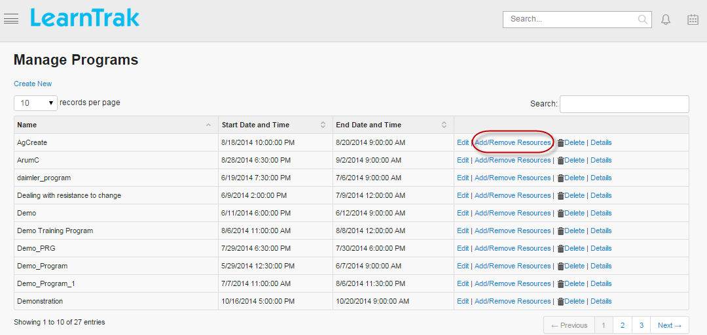
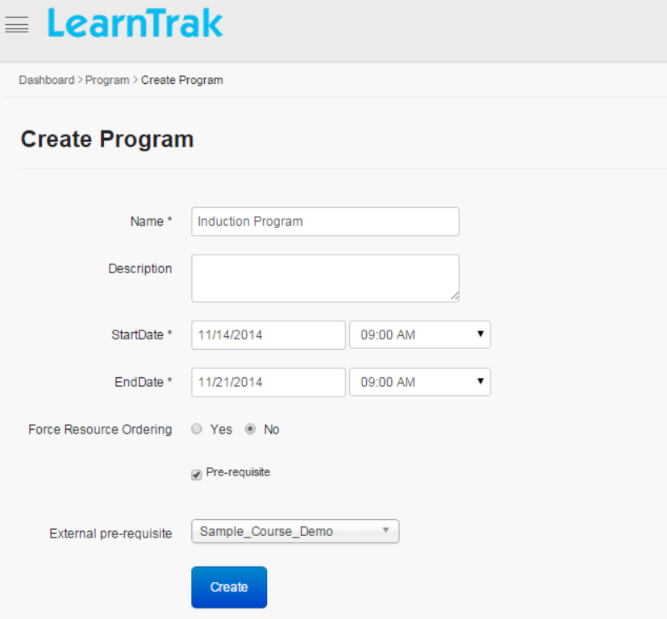
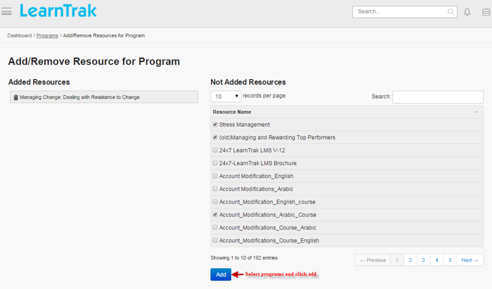

.. _online programs:
.. |Admin| image:: _static/admin_button.png
.. |Delete-Button| image:: _static/usr_del_tab.png
.. |Edit-Button| image:: _static/usr_edit_tab.png
.. |User-Details| image:: _static/usr_det_tab.png

**Online Programs**
*******************
•	The online program module, is a collection of resources (*AICC, SCORM 1.2, xAPI, URL, Documents, Videos, Assessments and Feedbacks*) that are bundled together and is assigned to either :ref:`single user <single users>` or :ref:`group users <group users>`.
•	The administrator can perform actions like creating the program, editing program, adding/removing the programs and viewing program details.

**Procedure to create online programs:**

  | •	**Step 1:** Create new online program
  | •	**Step 2:** Add or remove resources to the programs
  | •	**Step 3:** Map the online programs to single user or group users

*To access online programs:*

    Click |Admin| **Admin > E-Learning > Programs**. The following **Manage Programs** screen appears displaying lists of programs.

**Create New Program**
=====================
* The online programs are always created with *Start and End* date.
* The users must complete the program within the set start and end date & time.
.. note:: Other online programs can also be added as the resources in the form of *external pre-requisite*.

*To create new program:*

    Click **Create New**. The following **Create Program** screen appears with the respective fields to be filled.

.. important:: .. image:: _static/res_ord.png
  - When the **Force Resources Ordering** is set to **‘Yes’**,vthe administrator must select and add the resources for the particular program manually.
  - After adding the resources, it is published to single user or group users.
  - Selected resources, can then be rearranged manually in the desired order.
  - At user account, the program resources must be played in set order or else application displays a warning message.
  .. image:: _static/pre_req_ord.png
  - When the **Pre-requisite** is checked, it displays the list of pre-requisite programs to be selected from dropdown list.
  - Resources are selected and added manually for that particular external-pre-requisite program.
  - After adding the resources they are published to single user or group users.
  - Selected resources can then be re-arranged manually in the desired order.
  - At user account, the selected pre-requisite program must be completed first, in order to move to the next pre-requisite program.
  - If the user does not complete the prerequisite program, a warning message is displayed

**Edit, Delete and Details of Programs**
=======================================
*To edit program:*

    Click |Edit-Button| **Edit**. The **Edit Program** screen appears with the chosen fields to be edited.

*To delete program:*

    Click |Delete-Button| **Delete**. It automatically deletes the program resources.
.. note:: The online programs cannot be deleted, if it is assigned with the dependency. *For example*, if the programs are mapped to the single/group users, then those resources cannot be deleted.

*To view program details:*

    Click |User-Details| **Details**. The **Program Details** screen appears displaying online program details

**Add/Remove Resources or Programs**
====================================
* *To add programs:*

    Click **Add/Remove Resources**. The following **Add/Remove Resource for Program** screen appears where the administrator must select the programs to be added from the **Not Added Resources** list at the right to the **Added Resources** list at the left in the screen.

* *To remove the resources:*

    Click **Remove** button under **Added Resources** list.

* After adding the resources and programs, it must be published to the single user/group users.
* :ref:`To publish resources or programs to user groups <group users>`:

      Click  **Admin > User Groups > Manage User Groups > Add Resources |Programs**. The **Add Resources | Programs for the Group** screen appears where the resources or programs must be selected and added to the user groups.

.. important:: The programs published to the user groups appear under **My E-Learning Resources > Upcoming** tab. The program moves from **Upcoming** tab to **Current** tab, when the program set time equals the system time.
