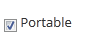
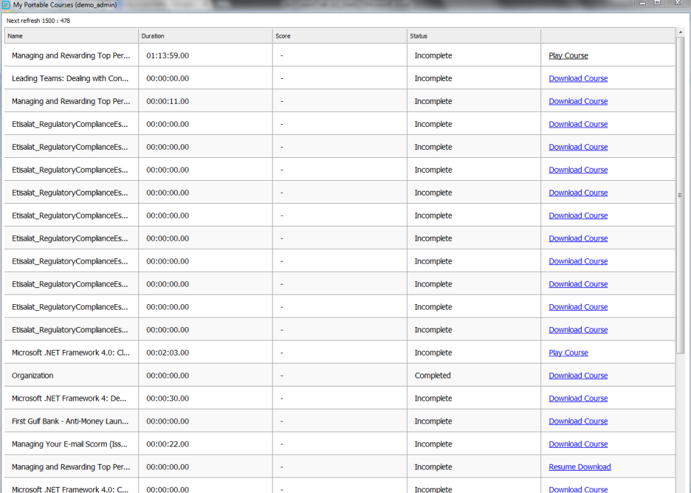

.. _portable:

**Portable**
===========

•	Portable is a *Windows application* that runs as a *normal desktop application*.
•	The functionality of the portable in LMS, is to play the *SCORM 1.2 and Experience API (xAPI)* courses in **offline mode (local system)**.
•	Once the course is uploaded, it is played by downloading it locally.
•	The course file plays from the local application and scores are updated by synchronizing it with the client URL.
•	If the course is suspended in the middle of the process, it can be resumed from the point it was paused earlier.
•	In LMS, the **portable** option must be checked to upload the SCORM 1.2 & Experience API courses. If the portable option is un-checked, it can be enabled by checking the **portable** option under **edit portable** and upload the course folder.
•	After the course is uploaded, it is published to the user groups and is accessed by installing the portable application to the local system and finally playing the course locally.
•	The courses are played much faster in portable application as compared to the online application.
•	The score tracking is done offline (locally) and score synchronization is done online.
•	With *Experience API* courses there is no time tracking limitations.
•	The forget password concept is not available with portable.
•	Internet not available or if it is too slow, the courses will not download and the score will not get synchronize.
•	The LMS allows the portable to be enabled or disabled at the **Tenant** level. Depending on the enabled or disabled portable, the set **Plan ID** is assigned to respective tenants.

**Encryption and Decryption of Course Data**
^^^^^^^^^^^^^^^^^^^^^^^^^^^^^^^^^^^^^^^^^^^^^
•	The courses are accessed by installing the portable application to the local system and playing the course locally.
•	The user must use only **Internet Explorer (IE)**, to install the application.
•	Once installed, the user can access the course via portable application from the local system.
•	The portable application is launched automatically when the system starts up every time and the application is synched based on the availability of internet.
•	The portable application is installed in a unique system and for unique users only. If other users are trying to access the portable application from their system, a request must be sent to the administrator.
•	The application has a password based encryption and decryption method for the course data.
•	On clicking the *download link*, the courses are saved to the local system in a ZIP file.
•	Post course download, the portable application encrypts the course data by giving the password. This encryption process is automatically performed by the portable application post course download.
•	The course file and all its related support files remain in encrypted format, which in-turn avoids decryption of the course to be played onto the other systems.
•	Refresh time is set for any actions performed on the portable, which will be reflected after the set time.
•	The course download process, can be paused in the middle and then be resumed later. Once resumed, the course starts downloading from the point (MB) it was suspended earlier.

**LMS API Token System**
^^^^^^^^^^^^^^^^^^^^^^^^^^
•	The API token security is created to avoid anonymous users from accessing the LearnTrak application.
•	When a user logs onto the portable for the first time, the server creates a token for each user as a part of the user authentication process.
•	The token has the expiry time of 14 days.
•	When the token expires, the user must login to the portable again and renew it for next 14 days, where it asks for the user password and the username remains the same.
