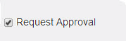

.. _request approval:

**Request Approval**
===================

* The *Request Approval* option when checked, the public resources become private resources.
* The private resources are mapped to the users.
* The administrator must select the private resources and publish it to either individual user or group users.
* At user account, the user must send resource request to the :ref:`reporting manager <reporting manager>` for approval/rejection.
* Click **Send Request**, to send approval request to the reporting manager.
* If the reporting manager approves the request, the users can add and launch the resources from their respective user account.
* Mail notification is sent to the users regarding resource approval or rejection.
* The resource request approvals is sent for the resources of type **AICC, SCORM 1.2, Feedback, URL, Videos, Assessments, Experienced API and Documents**.
.. note:: A resource already mapped and accessed by the users cannot be changed to request approval type resource.
