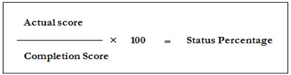

.. _resource completion criteria:
**Resource Completion Criteria**
================================
* The online resource reaches the completed state based on the set completion criteria.
* The course completion criteria are of 2 types:

    | •	**By visiting all pages**

        | o	Not started
        | o	In progress
        | o	Completed
    | •	**By scores**

        | o	Based on a maximum score
        | o	Based on mastery score
*Example:* If 100 is a maximum score, then 70 will be the mastery score.

**Formula for Status Completion:**
...................................

.. important:: 1. The *Score* is achieved within the course.
  2.	The *Status* reflects the current status with respect to the course.
  3.	The general and private courses are mapped to both single user and group users.
