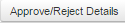

.. _eqm:

.. |User-Details| image:: _static/usr_det_tab.png

**External Qualification Measures**
*********************************
* The *external qualification measures (EQM)* is a type of external training provided to the users (or) employees in the organization.

    **Example:** Advanced Trainings, Seminars or Workshops.
* EQM helps users to develop their skills in the areas outside their current field and also broaden horizons which inturn boosts thier career prospectives.
* In LMS, the EQM is managed by **Head of Training (HoT)**.
* The HoT is a normal user with administrator privileges, but does not belong to any business unit.
* The head of training (HoT) is set at the **tenant level** and follows **two-level approval** hierarchy i.e., only one user is assigned as head of training for one tenant.
* The HoT receives EQM requests from the users irrespective of the business units.
* The head of training cannot be removed, but needs to transfer the HoT privileges to another user.

**Procedure to access the EQM:**

* **Step 1:** The user must send the EQM request from the dashboard.

              .. image:: _static/user_ext_dashboard.png
                 :height: 350px
                 :width: 500 px
                 :scale: 70 %
                 :align: center

              | * Click **View** to see the details of the EQM.
              | * Click **Request** button. The following **Create External Qualification Measures** screen appears as shown below.

                    .. image:: _static/user_ext_req.png
                       :height: 350px
                       :width: 500 px
                       :scale: 200 %
                       :align: center

              | * Fill-in the relevant details, upload the training materials (if any) and submit the EQM form.
              | * An EQM request is first sent to :ref:`reporting manager/ supervisor <eqm approvals>` for  the approval.
              | * When the reporting manager/ supervisor approves the EQM request, it is sent again to the head of training (HoT) for the final approval.
              | * The head of training (HoT) receives the EQM request.

                  .. note:: A mail notification is sent to HoT regarding the EQM request raised by the user for the approval.

* **Step 2:** *At HoT account:*

              | * Click |Classroom-Button| **External Training**. The following **External Qualification Measures Approval** screen appears displaying list of external training requests.

                .. image:: _static/hot_req.png
                   :height: 350px
                   :width: 500 px
                   :scale: 120 %
                   :align: center

             | * Click **Approve | Reject**.
             | * The approved EQM will be displayed on the user dashboard.
             | * The rejected EQM will not be displayed on the user dashboard and the status will be *Rejected by HoT* in the EQM details page.

                    .. note:: The user will receive mail notifications regarding the approve (or) reject EQM from the head of training (HoT).
* **Step 3:** *To view EQM report:*

              | * Click |Approve-Reject-Button| (or) |User-Details| to view all the approved | rejected EQM request details by the HoT.

                    .. image:: _static/rm_eqm_rep.png
                       :height: 600px
                       :width: 600 px
                       :scale: 400 %
                       :align: center

              | * The approved EQM details can be viewed by the *users', reporting manager/ supervisor* and the *administrator* at their respective accounts.
              | * Click **Details > View** to download the training materials (if any).

                      .. image:: _static/user_ext_det.png
                         :height: 350px
                         :width: 500 px
                         :scale: 200 %
                         :align: center
