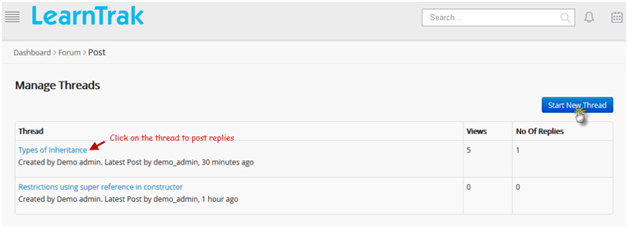

.. _forum:
.. |Admin| image:: _static/admin_button.png
.. |Delete-Button| image:: _static/usr_del_tab.png

.. |User-Details| image:: _static/usr_det_tab.png

.. |Classroom-Button| image:: _static/class_button.png

**Forum**
*********
•	The forum is an online discussion group, where the administrator posts topic of discussion for the users to participate and post replies on the same.
•	A forum can have any number of sub-forums; a sub-forum can have ‘n’ number of topics with relevant replies.

*The tree-structure of forum is given below:*
  .. image:: _static/forum_tree.png
.. note:: •	Threads are created either by an administrator or the user and is available to all the users in the LMS.
  •	Under each topic, new discussions are called as *Threads*.
  •	The users can participate in discussions, by posting replies to the respective threads.
  •	New threads created by users are managed by the administrator.

*To access forum:*
    Click |Forum-Button| **Forum**. The following **Manage Forum** screen appears displaying details on the list of forums created.

    .. image:: _static/mng_forum.png
     :height: 250px
     :width: 500 px
     :scale: 120 %
     :align: center

*There are 2 types of forums:*

  1. **General Forum:**
      | o	A forum is created based on general topics such as for example: Economics, Business, Education, Finance etc.
      | o	Only administrator/super admin/root admin has the right to create general forums and the users can participate by posting replies to the general forum.
  2. **Classroom Forum:**
      | o	The classroom forum is created based on the classroom training discussions.
      | o	Any of the users enrolled in the classroom training can create the threads and post replies.

*To add classroom training for discussion:*

      | •	Click |Classroom-Button| **Classroom > Trainings**. The **Classroom** screen appears.
      | •	Under **My Trainings >** click **List View >** click **Discussion**. It is re-directed to the **Forum** screen, where the trainings are added to the discussion.

**Create New Forum**
===================
*To create forum:*

      •	Click **Create New**. The following **Create Forum** screen appears with the respective fields to be filled.
      •	A new forum is created.

      .. image:: _static/crt_forum.png
         :height: 250px
         :width: 500 px
         :scale: 120 %
         :align: center
.. note:: The new forum created, appears in all enrolled user accounts and can participate by creating new threads and post the replies.

**Create New Thread**
^^^^^^^^^^^^^^^^^^^
*To create thread:*

    •	Click on the new forum name created. The following **Manage Threads** screen appears displaying information on the new threads created, view count and total number of replies.

    .. image:: _static/mng_thread.png
       :height: 250px
       :width: 500 px
       :scale: 120 %
       :align: center

   •	Click **Start New Thread**, to create a new thread for the discussion.
   •	The following **Create Thread** screen appears with the following fields such as *Subject, Message and Image to upload*.

   .. image:: _static/crt_thread.png
      :height: 250px
      :width: 500 px
      :scale: 120 %
      :align: center

**Post Replies**
^^^^^^^^^^^^^^^^
*To post replies:*

      •	Click on the newly created thread. The following **Thread Details** screen appears displaying details on the new thread.
      •	Click either of the tabs:

        | 1.	**Reply:** to post a new reply.
        | 2.	**Remove:** to remove the topic thread created.
        | 3.	**Edit:** to edit the thread details.

        .. image:: _static/thread_det.png
           :height: 250px
           :width: 500 px
           :scale: 120 %
           :align: center

      •	Click **Reply**. The following **Reply** screen appears to post replies to the particular thread.

      .. image:: _static/post_reply.png
         :height: 250px
         :width: 500 px
         :scale: 120 %
         :align: center

**Edit and Delete Thread**
^^^^^^^^^^^^^^^^^^^^^^^
*To edit thread:*

    Click **Edit** |Edit-Button|. The **Edit Thread** screen appears with the chosen fields to be edited.
.. note:: The *Edit* link will be enabled only for 15 minutes and then it will be disabled automatically.

*To delete thread:*

    Click **Delete** |Delete-Button|. It automatically deletes the specific thread.

**Delete Forum**
================
*To delete forum:*

    Click **Delete** |Delete-Button|. An alert box is displayed with the following message: *“This forum contains thread, Are you sure you want to delete?”*, click Ok or Cancel.

**Participate in the Forum**
===========================
•	Click on the selected forum name to participate in the discussions. The following **Manage Threads** screen appears displaying lists of threads for the discussion.

•	*User participations are based on 2 scenarios:*
    | o	**Scenario 1:** Users can start a discussion on the new thread > click **Start New Thread**.
    | o	**Scenario 2:** Users can discuss on the existing threads and post replies by clicking on the selected thread name.
