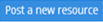
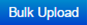

.. _user library:

**Digital Library**
================
•	The digital library is a collection of categories that allow users to post resources of *URL, Document, PDF, etc*.
•	Users can post resources under particular digital :ref:`categories or sub-categories <digital category>`.
•	Once the resources are posted, it is sent for approval from an *administrator or approver*.
•	The administrator or approver can view the resources before **approving | rejecting** the resources posted by the user.

*To access library:*

    Click  **Library**. The following **Library** screen appears displaying library categories, sub-categories and resource details.

    .. image:: _static/digital_library.png
     :height: 350px
     :width: 500 px
     :scale: 120 %
     :align: center

*To post new resources:*

     | •	Click |Post-New-Resources|. The following **Post a New Resources** pop-up screen appears to upload the resources.
     | •	Enter the details such as the *Category Name, Title and Description (if any)*.

          .. image:: _static/post_new_res.png
             :height: 350px
             :width: 500 px
             :scale: 120 %
             :align: center

      | •	Click **View**, to view the resources.
      | •	Click **Delete**, to remove the resources.

.. note:: - **Item Type** is either URL or document.
  - The LMS supports uploading MS-Documents of type *.Doc, .Docx, .Docm, .Dotx* etc.
  - **Thumbnail URL:** Users can upload the resource image via the URL.

*To upload bulk resources:*

  | •	Based on the category the resources can be uploaded in a bulk.
  | •	Click |Bulk-Upload|. The following **Bulk Upload Resources** pop-up screen appears to upload resources in the bulk.

      .. image:: _static/bulk_upload.png
         :height: 250px
         :width: 500 px
         :scale: 120 %
         :align: center
