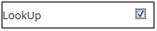

.. _audit log:

.. |Delete-Button| image:: _static/usr_del_tab.png
.. |Edit-Button| image:: _static/usr_edit_tab.png

.. |Active-Button| image:: _static/active_button.png

**Audit Logs**
=============
•	The audit log is a collection of records showing details of the users who has logged in and logged out of the system, with the IP addresses and within the given time period.
•	The audit log report can be generated based on the **Log Type**, as the applied filters.
• Some of the log type are as follows:

    1.	**Login Success**
    2.	**Logout**
    3.	**Login Failure**
    4.	**Program Create Success**
    5.	**Program Edited Success**
    6.	**Program Failure**
    7.	**Program Delete Success**
    8.	**Training Course Create Success**
    9.	**Training Course Edit Success**
    10.	**Training Course Delete Success**

*To access audit logs:*

    Click |System-Button| **System > Audit Logs**. The following **Audit Logs** screen appears displaying entire log details.

    .. image:: _static/audit_log.png
       :height: 150px
       :width: 500 px
       :scale: 120 %
       :align: center

*To display details:*

    Click **Details**. A pop-up screen appears displaying details for each user logs details such as *User Name, Type, IP Address, User Agent, Remarks and Logged On*.

    .. image:: _static/log_details.png
       :height: 150px
       :width: 500 px
       :scale: 120 %
       :align: center
