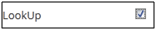

.. _custom field:

.. |Delete-Button| image:: _static/usr_del_tab.png
.. |Edit-Button| image:: _static/usr_edit_tab.png

.. |Active-Button| image:: _static/active_button.png

**Custom Fields**
================
•	The custom fields are the extra fields added to the list of existing fields.
•	The custom fields created are reflected on the Create User screen, under Learners module. Example: Department, Branch, Date of joining, College name, etc. are different types of custom fields.
•	The custom fields created are also reflected under the LMS Flexi reports.
• *The fields will be listed as the filters only in the following reports:*
    1.	**Test User Mapping**
    2.	**User Resource Mapping**
    3.	**User Login Report**
    4.	**User Details Report**
    5.	**User Program Mapping**
    6.	**Program User Mapping**

.. note:: The custom fields and the added character data limit are unlimited.

*To access custom field:*

    Click |System-Button| **System > Custom Field**. The following **Custom Fields** screen appears displaying information regarding custom fields added.

    .. image:: _static/custom_fields.png
       :height: 450px
       :width: 700 px
       :scale: 120 %
       :align: center

**Create Custom Fields**
-----------------------
*To create custom field:*
    Click **Create New**. The following **Custom Fields** screen appears with the relevant fields to be filled.

    .. image:: _static/crt_custom_field.png
       :height: 150px
       :width: 450 px
       :scale: 120 %
       :align: center
.. important:: - |Look-Up| when checked, the display options tab for the respective *Field Name*.
  - The *option* field displays a list of values to be entered in the custom field.

**Edit and Delete Custom Fields**
--------------------------------
*To edit custom field:*
    Click **Edit** |Edit-Button|. The **Edit Custom Field** screen appears with the chosen fields to be edited.

*To delete custom field:*
    Click **Delete** |Delete-Button|. An alert box is displayed with the following message: *“Do you want to delete the Field Name?”*, click Ok or Cancel.
