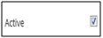

.. _reminder settings:

.. |System-Button| image:: _static/system_button.png
.. |Delete-Button| image:: _static/usr_del_tab.png
.. |Edit-Button| image:: _static/usr_edit_tab.png
.. |Look-Up| image:: _static/look_up.png

**Reminder Settings**
====================
•	Reminder settings allows the administrator to set reminders for the users to complete the pending activity like pre-works, requests not approved, give the feedbacks, update the action plans, invitations and nominations for the training programs.
•	The reminder settings are normally set at a, **global level** or **local level**.
•	If the administrator sets the remainder at global level; it is applicable to all the available trainings.
•	When the reminder is set at local level, it is applicable only to the particular training instances.

*To access reminder settings:*

   Click  |System-Button| **System > Reminder Settings**. The following **Reminder Settings** screen appears displaying details on reminder *Situations and Actions*.

   .. image:: _static/reminder_settings.png
      :height: 150px
      :width: 450 px
      :scale: 120 %
      :align: center

**Different types of reminder setting as follows:**

+--------------------------+-----------------------------------------------------------------------------+
|       Situations         |                          Actions                                            |
|                          |                                                                             |
+==========================+=============================================================================+
| APSettingtoReview1Cycle1 | If the supervisor has not reviewed his/her team members updated action plan |
|                          | within X no of days in the first cycle, then a first reminder mail will     |
|                          | trigger to supervisor.                                                      |
+--------------------------+-----------------------------------------------------------------------------+
| APSettingtoReview2Cycle1 | If a supervisor has not reviewed his/her team members updated action plan   |
|                          | within X no of days in the first cycle, then a first reminder mail will     |
|                          | trigger to supervisor.                                                      |
+--------------------------+-----------------------------------------------------------------------------+
| APSettingToUpdate1       | First reminder mail that will trigger to users who have not updated their   |
|                          | first cycle action plan by X no of days.                                    |
+--------------------------+-----------------------------------------------------------------------------+
| APSettingToUpdate2       | Setting reminder mail that will trigger to users who have not updated their |
|                          | first cycle action plan by X no of days.                                    |
+--------------------------+-----------------------------------------------------------------------------+
| APUpdateToSupervisor     | A consolidated mail will trigger to supervisor by X No of days if any of    |
|                          | his/her team members have not updated their action plan even after the      |
|                          | end date.                                                                   |
+--------------------------+-----------------------------------------------------------------------------+
| MaxSeatReminder          | A mail will trigger to admin if the nomination count does not meet maximum  |
|                          | users count by X no of days before the training program starts.             |
+--------------------------+-----------------------------------------------------------------------------+
| PostFillFeedback         | A mail will trigger by X no of days after the program ends to all attended  |
|                          | users who have not filled their feedback.                                   |
+--------------------------+-----------------------------------------------------------------------------+
| Prework                  | If the users have not uploaded their pre-work resources by X no of days     |
|                          | before the training program starts, then a reminder mail will trigger       |
|                          | to those users.                                                             |
+--------------------------+-----------------------------------------------------------------------------+
| ProgramInvitation1       | First program invitation mail will trigger by X no of days to all confirmed |
|                          | users before the training program starts.                                   |
+--------------------------+-----------------------------------------------------------------------------+
| ProgramInvitation2       | Second program invitation mail will trigger by X no of days to all confirmed|
|                          | users before the training program starts                                    |
+--------------------------+-----------------------------------------------------------------------------+
| SupervisorReqNotApproved | If the supervisor has not approved his/her team members request for a       |
|                          | private training even after X No of days post users request,                |
|                          | then requester will get a mail.                                             |
+--------------------------+-----------------------------------------------------------------------------+
| WaitingListNomination    | A mail will trigger by X no of days before the training program starts      |
|                          | with users who are in waiting list.                                         |
+--------------------------+-----------------------------------------------------------------------------+

**Edit Reminder Settings**
--------------------------
*To edit reminder:*
    Click **Edit** . The following **Edit Reminder** screen appears with the respective fields to be edited.

    .. image:: _static/edit_reminder.png
       :height: 150px
       :width: 450 px
       :scale: 120 %
       :align: center

.. important:: |Active-Button| when checked, only the respective reminder mails will be triggered for the users.
