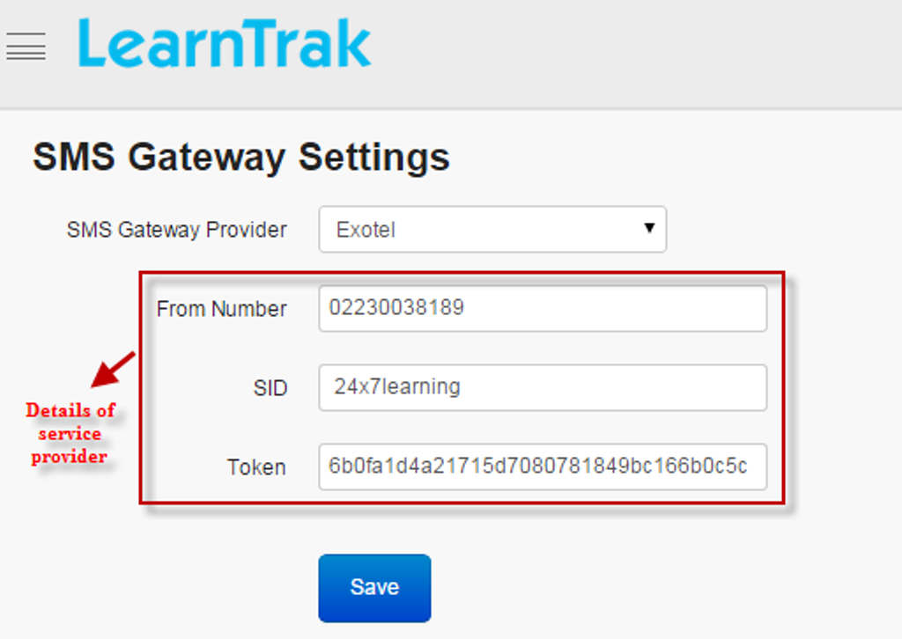

.. _sms settings:

.. |System-Button| image:: _static/system_button.png
.. |Delete-Button| image:: _static/usr_del_tab.png
.. |Edit-Button| image:: _static/usr_edit_tab.png
.. |Look-Up| image:: _static/look_up.png
.. |Active-Button| image:: _static/active_button.png

**SMS Gateway Settings**
========================
•	SMS Gateway is a mechanism for sending and receiving event notifications via SMS messages.
•	SMS messages sent and received are handled by professional business SMS providers.
•	*The external service providers used by LearnTrak LMS are:*

       1.	**Exotel**
       2.	**Twilio**

•	*Once registered, service providers provide information on:*

       | o	**SID**
       | o	**Token**
       | o	**From number**
•	Based on these parameters, the SMS is integrated with SMS gateway settings and the messages are either sent or received accordingly.

