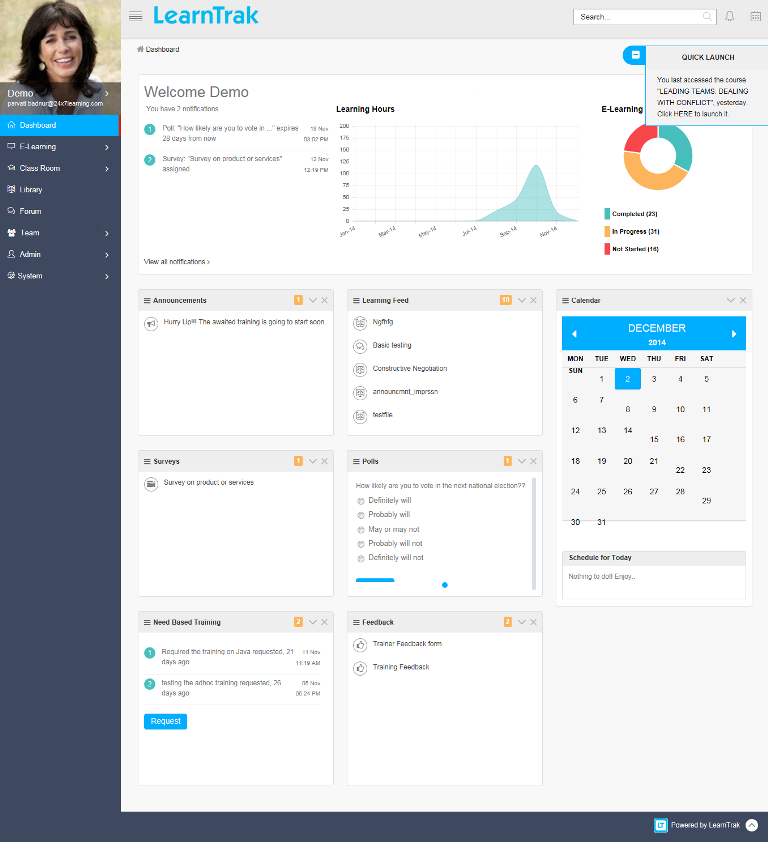

.. _getting-started:

**LMS Dashboard**
===============

The *LearnTrak Management System* dashboard provides at a glance view of all the current user activities. Some of the important activities are as follows:

•	The dashboard display information on the *classroom trainings, surveys, polls & responses, announcements, needbased trainings, learning feeds and feedbacks*.

•	The *Learning Feed* displays list of available e-learning courses, forum threads & replies and the library resources.

•	Under *Need Based Training* the user can send the request to Adhoc trainings.

•	The dashboard allows administrators to handle the *System Settings* of LMS application.

•	The *Team* tab is available to the reporting managers', that provide information’s on all the reportees and also help handle different types of approvals.

•	The *Admin* tab allows the administrator to manage the administrative activities like creation, edition, deletion and updation of all the important modules.

•	The *Forum* tab allows administrator to create different types of forums like general forum and classroom training forum, allowing users' to participate by starting a new threads and posting the replies.

•	The *Digital Library* allows administrator to create library resources based on the categories and sub-categories that allows user to upload resources of type URL, Document, PDF, etc under a particular category.

•	Graphical view is presented for both *Learning hours* and *E-learning status*. The  learning hours shows, as to how many hours spent on the classroom trainings & e-learning courses in a particular month and the e-learning status display a graphical representation on the status of the courses assigned to the users', i.e, ‘completed’, ‘in progress’ or ‘not started’.

•	Users' are provided with *Quick Launch* facility on the last accessed resources for AICC and SCORM 1.2 courses which is in the ‘in progress’ state from the previous login.

•	The *Calendar* provides quick information on the classroom trainings scheduled for a particular date and month.

•	The dashboard shows a short preview of the *Leaderboard* and *Visual Graph* as widget.

