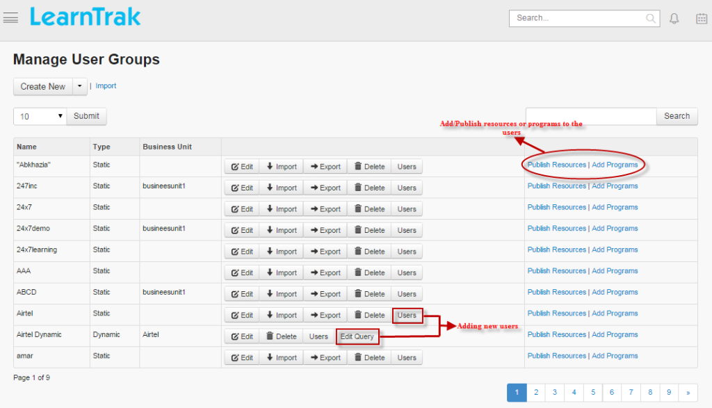
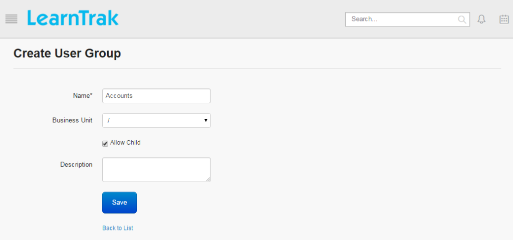

.. _group users:
.. |Admin| image:: _static/admin_button.png
.. |Delete-Button| image:: _static/usr_del_tab.png
.. |Edit-Button| image:: _static/usr_edit_tab.png

**Group Users**
****************
•	The administrator can create user groups as either static or dynamic and add them to different business units.
•	The user groups  can also be created with or without business units.
•	All the users in the group are assigned with the *classroom trainings, resources or programs, polls, surveys, digital library and announcements*.

**The group users are classified into 2 ways:**

  | 1.	Static Group Users
  | 2.	Dynamic Group Users

**Static Group Users**
=======================
  •	The static user groups are added or removed manually and can be created with or without business units.
  •	Child properties are allowed.
  •	The entire group can be deleted by first removing all the users from the particular group.
  •	**Procedure to add static users:**

        * Click **Users**. The following **List of Users** screen appears displaying a list of users that are added to the respective group.
        .. image:: _static/static_usr.png
           :height: 385px
           :width: 550 px
           :scale: 110 %
           :align: center
        *	Click **Add** to add mapped business unit users to the group.
        *	Click **Remove** to delete the static users.

**Dynamic Group Users**
=======================
  •	The dynamic user groups are created with or without business unit.
  •	Child properties are allowed.
  •	The users are added to the dynamic group by passing the query as a condition **(AND/OR)**, that is filtered based on the following:
      **1.	Parameters:**
            * User Name
            * First Name
            * Last Name
            * Business Code
            * Email
            * Gender
            * Designation
            * Locations
            * Manager
            * Job Role
      **2.	Conditions:** =, =, <, >, <=, >=, Contains.
  •	**Procedure to add dynamic users:**

        *	Click **Edit Query**. The following **Edit Query** screen appears where a query is passed to add the dynamic users.
        *	Click **Add** to add the mapped business unit users. The count on the number of users added is also listed.
        *	Click **Users** to view list of dynamic users added to the particular group. *Example: Username = amit (AND/OR) > click* **Add**.
        .. image:: _static/edit_query.png
           :height: 385px
           :width: 550 px
           :scale: 110 %
           :align: center
.. important:: 1.	**Contains:** Is an operator that matches against only the specific word in the given string.
  2.	The dynamic users are removed manually.

**To create group users:**

1.	Click |Admin| **Admin > Manage Users > User Groups**. The following **Manage User Groups** screen appears as shown below.

2.	Click **Create New >** select **Static | Dynamic**. The following **Create User Group** screen appear consisting of required fields to be filled.

.. important:: **Allow Child** when checked, represents the parent-child relationship, where users of both child BU and parent BU is included.
.. note:: - The maximum *Name* field limit is 100 characters (any character).
  - The **Users** button displays list of static or dynamic users added to the respective user groups.
  - The **Update Group** updates the group with new or existing (static/dynamic) users of the respective business units (BU). The users are filtered based on the query passed as a condition in the **Edit Query** option for the dynamic group and as for the static group the users are updated manually.

      | * The **Update Group** button is available for both static/dynamic group users.
      | * The users required to be updated to the static/dynamic group are listed under the **Users Available for Updation**.
      | * Click **Update Group**, to update the users to the respective static/dynamic groups.
      | * The updated users will be listed under **Users** of the respective static/dynamic group.
      | * The resources or programs mapped are available to the respective user groups.
  - Click **Import** to upload bulk users. The **Import User Groups** screen appears to upload bulk users by importing .csv file. The .csv file size should be less than or equal to 4MB. Refer :ref:`Bulk Uploading Process <bulk users upload>` under **Single Users > Import Bulk Users**.
  - Click **Export** to export user’s details to the .csv file. Refer **Export Users** process under **Single Users**.

**Publish Resources or Add Programs to Group Users**
======================================================
•	The resources or programs are published to the user groups.
•	*To publish resources/program:*

    |   * Click **Publish Resources | Add Programs** tab.  The **Publish Resources/Programs for the Group <group_name>** screen appears to publish the resources or programs.

    |   * Select resources or programs to be added from the **Not Added Resources/Programs** list to the **Added Resources/Programs** list and later map the resources or programs to the user groups.
•	*On user account:*

    | * **Online resources:** are listed under **Available E-Learning Courses** tab, where the users are required to add the resources.
    | * **Online programs:** are listed under **My E-Learning Courses tab > Upcoming** tab.

.. important:: .. image:: _static/add_usr_direct_button.png
      - The selected resources is added directly to the users by checking the **Add Directly to Users**. Once resources are added, it appears directly under **My E-Learning Courses > Current** tab, instead of the **Upcoming** tab on the user account.
      - Request approval type resources when added directly, it bypasses the rule of approval from the reporting manager or administrator and gets listed under **My E-Learning Courses** tab.
      .. image:: _static/send_mail_button.png
      - When checked, a mail is sent to the users regarding the published resources or programs.

**Edit and Delete Group Users**
==============================
*To edit group users:*

      | Click **Edit** |Edit-Button|. The **Edit User Group** screen appears with the chosen fields to be edited.
*To delete group users:*

      | Click **Delete** |Delete-Button|. It deletes the selected user groups.
