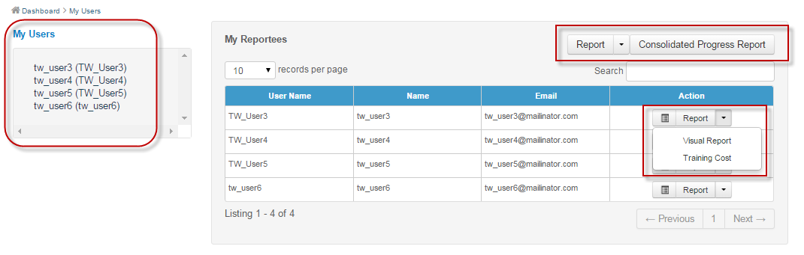
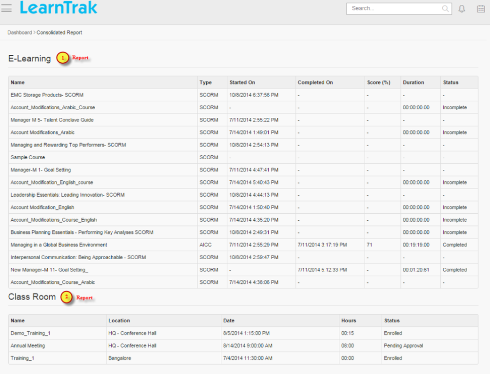

.. _reporting manager:


**Reporting Manager**
=================

•	The *reporting manager* is an administrator who enjoys the access rights. The reporting manager has the right to approve or reject request to the training programs or online resources of its reportees, view team details, track completion status of the team, manage approvals and escalations.
•	The **Team** tab is available only to the reporting manager. It is not mandatory for the users to have the reporting manager. The reporting manager can play the role of an *administrator* or :ref:`trainer <trainer>` simultaneously.

*To access reporting manger account:*

    On the main menu > click |Team| **Team**.

  .. image:: _static/team_menu.png
**This module is divided into following sub-modules:**

  1.	My Users
  2.	Action Plan Review
  3.	:ref:`Needbased Training Approval <needbased approvals>`
  4.	:ref:`Library Approval <library approval>`
  5.	:ref:`Pre-work Approval <pre work approval>`
  6.	:ref:`Resource Request Approval <resource request approval>`
  7.	:ref:`Renew Program Approval <renew program approvals>`
  8.	:ref:`Assessment Request Approval <assessment request approval>`
  9.  :ref:`External Qualification Measures Approval <eqm approvals>`
  10. Supervisor Evaluation Feedback

**My Users**
-------------
•	The **My Users** tab display reporting manager’s team, i.e. the number of reportees reporting to a particular reporting manager.
•	If the business unit has a child business unit, then the users under the child business unit are also displayed which helps reporting manager to keep track on the number of reportees.

*To access my users:*

    | Click |Team| **Team > My Users**. The following **Business Units Users** screen appears displaying parent and child business unit users under each business unit.


**User Consolidated Report and Details**
````````````````````````````````````````
•	The consolidated report generates individual reportees report for both e-learning courses and the classroom trainings.
•	It displays details such as *name, status, type of resources, location details, score of classroom training and e-learning courses,* etc.

*To display consolidated report:*

    | Click **Report**. The following user’s **Consolidated Report** screen appears displaying reportees report on the *e-learning courses* and the *classroom trainings*.


*To view details:*

   | Click **Details**. The **Details** screen appears displaying details on *User name, First name, Last name, Email, Mobile and Business Unit*.

**Individual Team Reportee's Visual Report, Consolidated Progress Report and Training Cost Report**
``````````````````````````````````````````````````````````````````````````````````````````````
* **Individual team reportee's visual report:**

      -	The individual team reportees :ref:`visual report <visual report>` displays a graphical user interface (GUI) report of the particular team reportee.

      - *To access:*

            | Click **Report > Visual Report**. The **Visual Progress Chart** screen appears displaying the particular team reportees *login report, feedback report, e-learning & classroom report activities*.

* **Individual team reportee's consolidated report:**

      -	The individual team reportees :ref:`consolidated progress report <consolidated report>` displays combined report of all the reportees reporting to particular reporting manager.

      - *To access:*

            | Click **Consolidated Progress Report**. The **OverAll User Progress Status** screen appears displaying *login report, feedback report, e-learning & classroom reports* of all the reportees reporting to a particular reporting manager.

* **Individual team reportee's training cost report:**

      - The team reportees :ref:`training cost <training access>` report displays individual reportees total instance cost details for the attended and not attended classroom training.

      - *To access:*

             | Click **Report > Training Cost**. The **Training Cost Details of Individual User** screen appears displaying training instance cost details such as *training name, location, present and absent costs*.

**TNI Report of Reportees**
````````````````````````````
* This generates detailed report on the training need indentification (TNI) published to all the reportess under particular reporting manager.
* *To access:*

      Click **Team > Report > TNI Report**.

      .. image:: _static/tni_reportees.png
       :height: 250px
       :width: 500 px
       :scale: 120 %
       :align: center

 * Refer :ref:`TNI Report <tni>` under **TNI** for more details.

**My Team's Training Cost**
````````````````````````````
* The team's consolidated training cost report displays each instance's total cost for the attended and not attended classrom trainings by the reportees'.
* This report can be filtered based on the *Username, Start and End date*.
* The report is exported to the *Excel* in .csv file format.

*To access team's training cost report:*

    | * Click **Report > My Team's Training Cost**. The following **Consolidated Team Training Cost Details** screen appears as shown below.

      .. image:: _static/team_training_cost.png
         :height: 250px
         :width: 500 px
         :scale: 120 %
         :align: center

    | * Click **Export to Excel** to export the report to the .csv file.

**Pending Action Plan Task Creation**
------------------------------------
* Once the classroom training starts and the attendance is taken by the administrator/ trainer, the action plan task creation will be available to the reporting manager under the **Team > Pending Action Plan Task Creation** tab.
* The reporting manager/supervisor must create :ref:`action plan tasks <action plans>` on the completed classroom trainings.
.. note:: The reporting manager will receive mail notifications for the action plan task creation for the particular user.
* The  reporting manager/supervisor create's the task for the action plan.

*To create action plan task:*

    | * Click **Team > Pending Action Plan Task Creation**. The following **Pending Action Plan Task Creation** screen appears as shown below.

      .. image:: _static/action_plan_task_crt.png
         :height: 250px
         :width: 500 px
         :scale: 120 %
         :align: center

    | * Click **New Task** to create new task for the action plan. The following **Create Task** screen appears as below.

      .. image:: _static/crt_task.png
         :height: 250px
         :width: 500 px
         :scale: 120 %
         :align: center

         | * Fill-in the relevant details and click **Submit**.

.. note:: The user will receive a mail notifications on the newly added action plan task.
* On user account, the user must provide review on the newly assigned action plan task.

*To view action plan task details:*

    | * Click **Task Details** to view information on the 

**Pending Action Plan Task Review**
----------------------------------

**Supervisor Evaluation Feedback**
----------------------------------
* The supervisor/ reporting manager must give *evaluation feedback* to the users for the particular classroom training.
* The **supervisor evaluation feedback** is available to the supervisor/ reporting manager only if the evaluation feedback form is attached to the classroom training.
* The supervisor evaluation feedback settings is set at the tenant level.
* Based on the tenant set value the evaluation feedback is displayed to the supervisor.
* The evaluation feedback is given only once per user for the particular training instances.

*To access:*

    | * Click |Team| **Team > Supervisor Evaluation Feedback**. The following **Supervisor Evaluation Feedback** screen appears.

    .. image:: _static/supervisor_eval_feed.png
       :height: 385px
       :width: 550 px
       :scale: 150 %
       :align: center

    | * Click **Give Feedback** to provide the feedback.

*To view feedback given:*

    | * Click **Feedback Given**. The following **Feedback Given** screen appears listing all the supervisor evaluation feedbacks given by the supervisor/ reporting manager.

    .. image:: _static/supervisor_feed_det.png
       :height: 385px
       :width: 550 px
       :scale: 150 %
       :align: center

    | * Click **View Feedback** to see the feedbacks given by the supervisor/ reporting manager to user for the particular training.

    .. note:: The feedbacks can be filtered based on the *Start & End date, Training name and User name*.
