.. _single users:
.. |Admin| image:: _static/admin_button.png

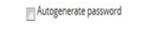
.. |Delete-Button| image:: _static/usr_del_tab.png
.. |Edit-Button| image:: _static/usr_edit_tab.png
.. |User-Details| image:: _static/usr_det_tab.png

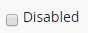
.. |Select-Button| image:: _static/tk_at_button.png

**Single User**
================
•	The administrator can create users with or without business units.
•	The users created can also be a BU administrator who in turn has the rights to create and add as many users under each business unit.
•	The BU administrator can access all the details of the users created under them.
    .. image:: _static/user_menu.png
       :height: 250px
       :width: 250 px
       :scale: 110 %

**Create Users**
---------------
**To create single users:**

1.	Click |Admin| **Admin > Manage Users > Users**. The following **Manage Users** screen appears.
  .. image:: _static/single_usr.png
     :height: 385px
     :width: 550 px
     :scale: 110 %
     :align: center
.. note:: After the resources/programs are created, they must be published to the single users. Refer **publish or add resources to single users** to map the resources/programs.

2.	Click **Create New**. The following **Create User** screen appears with relevant fields to be filled.
  .. image:: _static/crt_single_usr.png
     :height: 385px
     :width: 550 px
     :scale: 110 %
     :align: center

.. important:: 1.	It is mandatory to place each user under the respective *business units*. If business unit is set to **“/”**, then the users are created under general business unit representing no parent-child relationship.
  2.	The **location** is mapped to the :ref:`classroom location <location>`.
  3.	The **email** field is mandatory.

.. note:: - The :ref:`business unit <business-units>` and :ref:`reporting manager <reporting manager>` is not mandatory for all users.
  - The reporting managers are grouped under different business units.
  - The user types are selected from the dropdown list:

      | **1.	Learner**
      | **2.	Admin**
      | **3.	SysAdmin**
  - The contact type is also selected from the dropdown list:

      | **1.	Full time & Part time**
      | **2.	Fixed time**
      | **3.	Seasonal**
      | **4.	Casual and Independent**
  - |Send-Mail| when checked, users will receive mail regarding the new account creation.
  - |Auto-Generate-Pwd| when checked, it generates an automatic password.
  - The **Custom Fields** are additional field of information that is added to the existing fields.

**Edit and Delete User**
^^^^^^^^^^^^^^^^^^^^^^
*To edit user:*

    | Click **Edit** |Edit-Button|. The **Edit Account** screen appears with the chosen fields to be edited.
.. note:: |Disabled-Button| when checked, the user account is disabled and will be unavailable to the user. The disabled account can be enabled again later.
*To delete users:*

     | Click **Delete** |Delete-Button|. It deletes the selected users.
.. note:: Single users cannot be deleted, if it is assigned with a dependency. *For example*, if single users are grouped under a particular group or if is assigned to the resources/programs, then it cannot be deleted.

**Details and Reset Password of User**
^^^^^^^^^^^^^^^^^^^^^^^^^^^^^^^^^^^^
*To display user details:*

  | * Click **Details** |User-Details|. The **Details** screen appears displaying selected user details.
  | * The **Details** screen provides option to edit user details at any point, by clicking **Edit** |Edit-Button|.
*To reset password:*

  | Click **Reset Password** |User-Reset-Pwd|. The **Reset Password** screen appears.

**Import Bulk Users**
--------------------
* The users are :ref:`uploaded in bulk <bulk users upload>` by importing it via **.csv file**. The .csv file size should be less than or equal to 4MB.
* Click **Import**. The following **Import Users** screen appears.

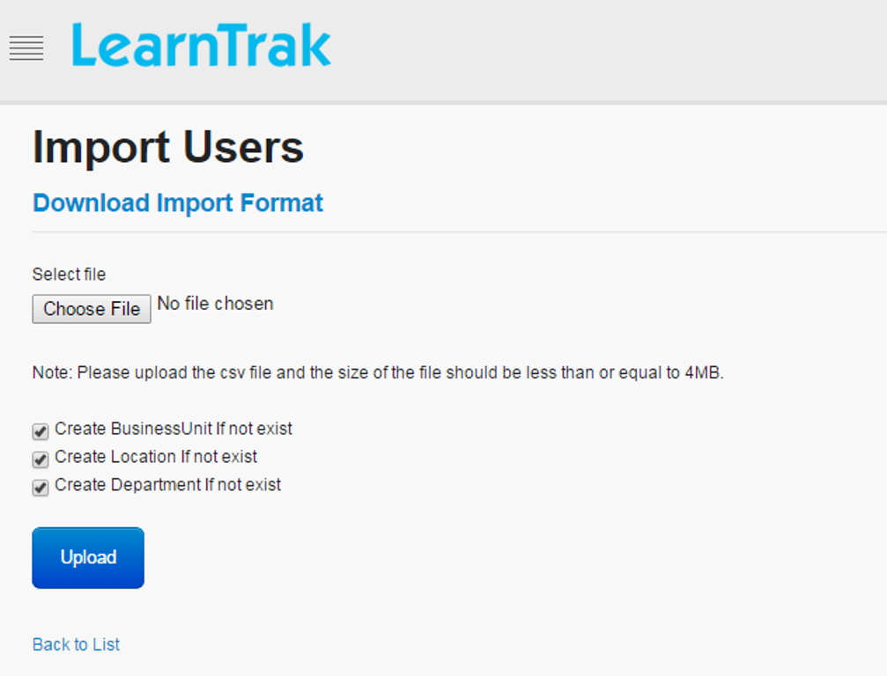

.. important:: - |Select-Button| **Create business unit, if not exist:** While importing users, if new business unit name does not exist in the application, then it is automatically created along with its users while uploading the .csv file.
  - |Select-Button| **Create location, if not exist:** While importing users, if new location name does not exist in the application, then it is automatically created while uploading the .csv files.
  - |Select-Button| **Create department, if not exist:** While importing users, if the new department name does not exist in the application, then it is automatically created while uploading the .csv files.

**Delete Users**
--------------
Multiple users can be deleted either by selecting the specific user or by selecting all the users at a single select.

*To delete users:*

  | •	Select |Select-Button| the desired users > click *Delete* > deletes only the selected users **(or)**
  | •	Select |Select-Button| *User Name* column > click *Delete* > deletes all the users.

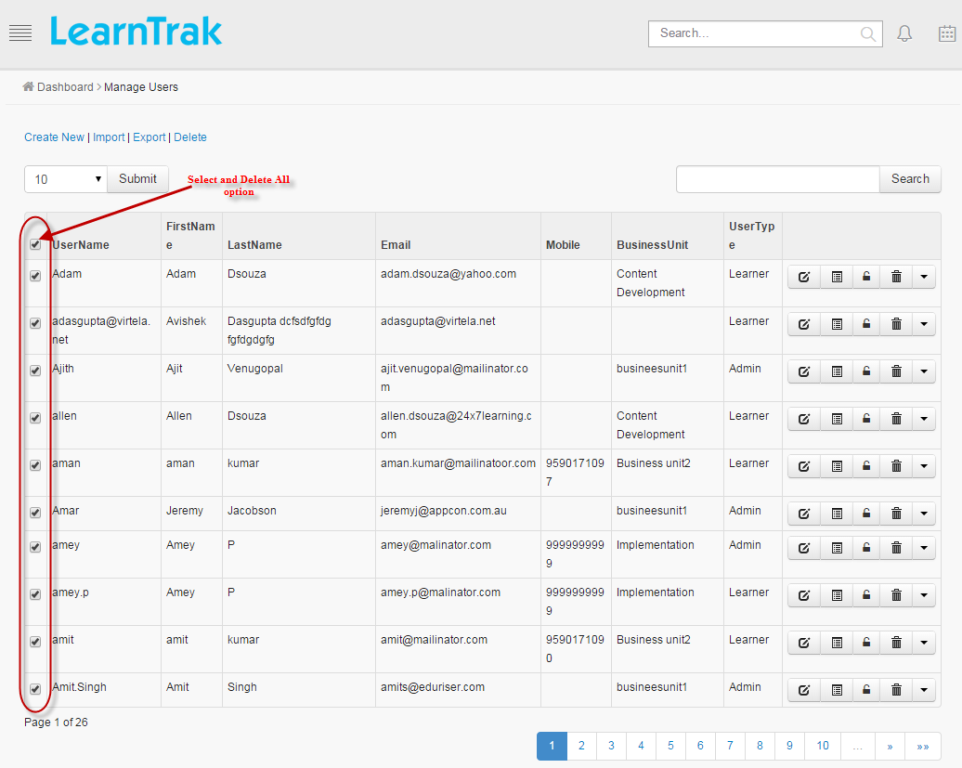

.. note:: - Newly added users can be deleted.
    - The user cannot be deleted, if is assigned with a dependency.
    - For example:
       1.	If a single user is grouped under a particular user group or is assigned to the resources/programs, then it cannot be deleted.
       2.	The users who have already logged into the LMS, cannot be deleted.

**Export Users**
---------------
The user’s details are exported to the **Excel** in .csv file.

*To export users:*

    | Click **Export**, to export details to the respective .csv file.

**Publish Resources or Programs to Single Users**
------------------------------------------------
*To add or publish resources to single users:*

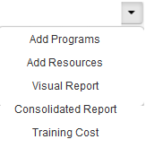

a. Online resources and programs can be added directly to the individual users. The added :ref:`resources <online course>` or :ref:`programs <online programs>`, will be directly listed under **My E-Learning Courses** tab.
b.	The request approval type resources when added directly, it bypasses the rule of approval from the reporting manager or administrator and will be listed under :ref:`My E-Learning Courses <accessing elearning courses>` tab.
c.	The :ref:`visual report <visual report>` displays the graphical user interface report of a **particular user** reporting to the administrator/super admin under the same business unit.
d.	The **consolidated report** generates combined user report for both e-learning courses and the classroom trainings assigned to **particular user**.
  * It displays particular user details such as *name, status, type of resources, location details, scores, etc* for the *classroom trainings* and *e-learning courses*. Refer **User Report** for more details.
  * This report can be **exported** to the excel in the .csv file format.
e. The :ref:`training cost <training access>` report displays details on the individual user's total instance cost for the attended and not attended classroom training.

**Graphical View Report**
-----------------------------
* The consolidated visual progress chart is displayed for the reporting manager, administrator and all its listed reportees/users.

    | **1.	For Reporting Managers:** Displays the combined report of all the reportees reporting to the reporting managers.
    | **2.	For Administrators:** Displays the combined report of all the users reporting to the administrator/super admin under the same business unit.
* The consolidated visual chart is divided as follows:

    * **E-learning Report**
    * **Login Report**
    * **Classroom Training Report**
    * **Feedback Report**
* The e-Learning report displays the graphical user interface report for both e-learning programs and the resources.
* The feedback reports are classified as follows:

    * **Participant Feedback**
    * **Trainer Feedback**
    * **Training Feedback**
    * **Question Analysis Report**
    * **Trainer Status Report**

*To access:*

   | Click **Admin > Manage Users > Users > Consolidated Report > Graphical View Report**. The following **OverAll User Progress Visual Chart** screen appears as shown below.

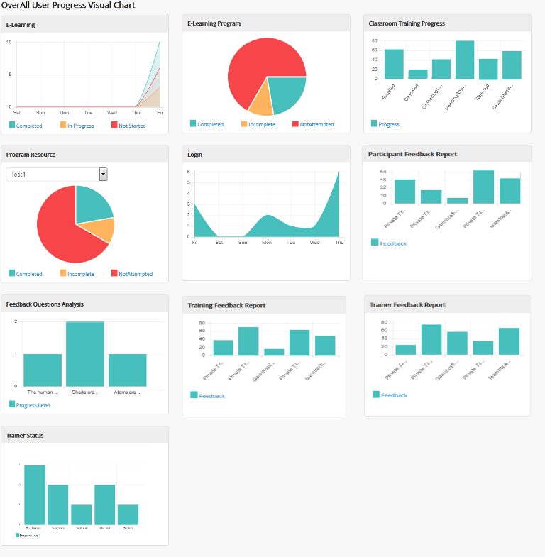

**OverAll User Progress Visual Chart**
^^^^^^^^^^^^^^^^^^^^^^^^^^^^^^^^^^^^^
**E-Learning**
+++++++++++++
* The E-learning chart provides quick view on the resources count based on the status of the resources for the administrator/reporting manager.

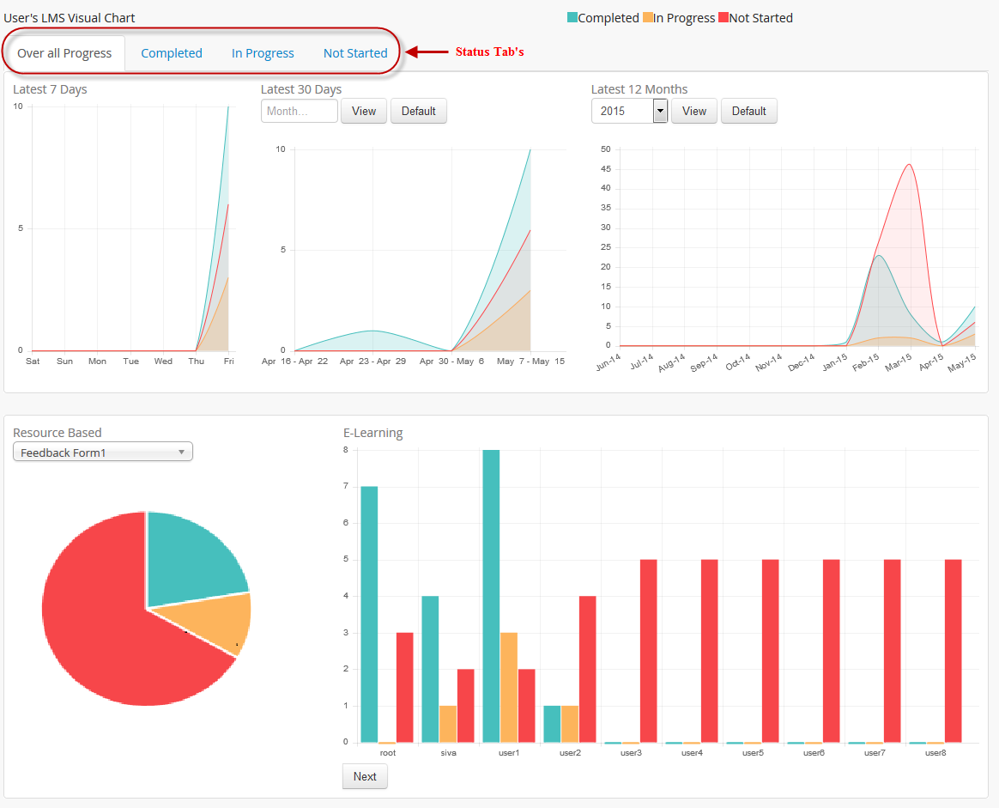

* The status of the any resources can be either **Completed, In-Progress or Not Started**.
* The administrator/ reporting manager can click on the respective status tabs to check for the assigned resources progression of the users / reportees.
* **At the administrator level:** the latest 7 days, 30 days and 12 month chart display the e-Learning course count based on the respective status of each user under the same business unit.
* **At the team level:** the latest 7 days, 30 days and 12 month chart display the e-Learning course count based on the respective status of all the reportees reporting to a particular reporting manager.
* The **resource based** report displays the overall progress of the selected resource, i.e., total number of user status either as completed, in-progress or not started.
* The **e-Learning** report displays reportees listed under the reporting managers hierarchy and as for the administrator, the users listed under the administrator’s business unit will be displayed.

**E-learning Program Chart**
+++++++++++++++++++++++++++
* The e-Learning program chart displays the overall program progress status of all the users.

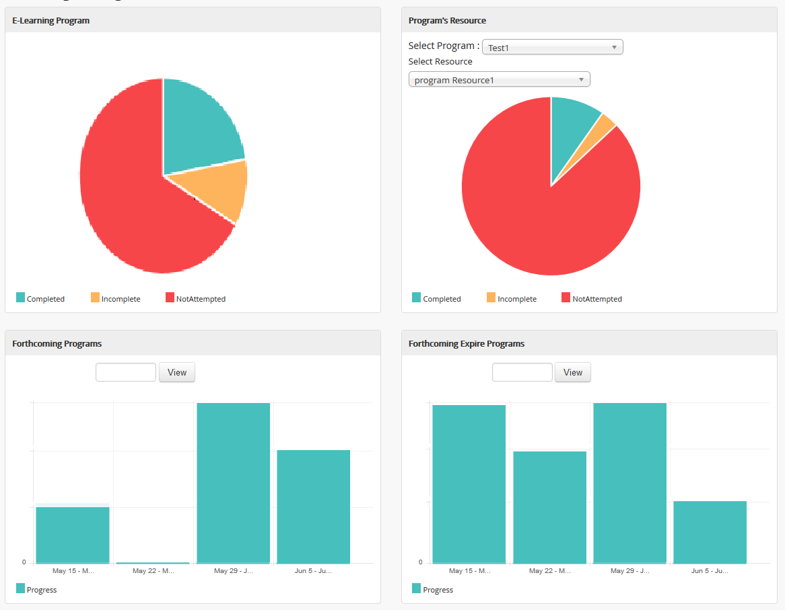

* The e-learning program progress report for the reporting manger displays consolidated program status of the team reportees.
* The administrator e-learning program progress report, displays consolidated program status of all the users belonging to the administrator’s business unit.

   |  o	**E-learning program:** Provides quick view of the programs count based on the status, i.e. completed, in-progress or not started by the team reportees/ users.
   |  o	**Program resources:** Display a graphical representation of a particular program’s resource status count of the team reportees/ users on selecting the resource.
   |  o	**Forthcoming programs:** By default, it displays a graphical representation of the programs that are to be added to the team reportees/ users for the next 30 days.
   |  o	**Forthcoming expire programs:** By default, it displays a graphical representation of the programs that is about to expire by next 30 days for the team reportees/ users.

**Classroom Training Progress Chart**
^^^^^^^^^^^^^^^^^^^^^^^^^^^^^^^^^^^^
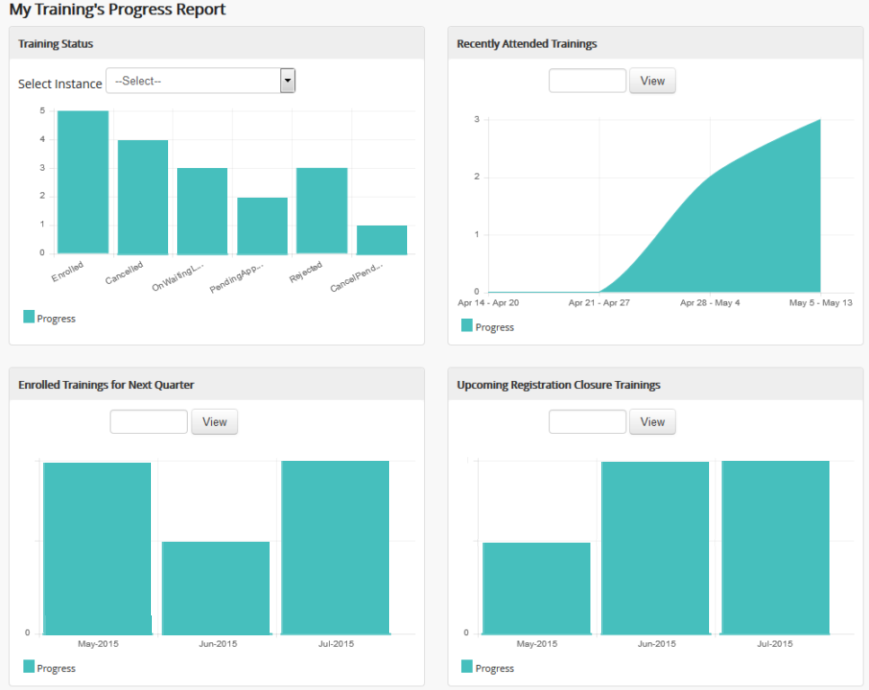

**Training**
++++++++++
* **At administrator/team level:** the trainings instances published to the users or reportees by the administrator or reporting manager will be listed in the drop down list.
* The instance count is displayed based on the trainings published to the users/reportees by the administrator or reporting manager.

**Recently Attended Trainings**
+++++++++++++++++++++++++++
•	The training chart displays a graphical representation of the recently attended classroom trainings by the team reportees or by all the users for the last 30 days.
•	The chart displays the complete month report of the training instance count for which the attendance is already taken.
•	The entire month chart is split into the week-based chart

**Enrolled Trainings for Next Quarter**
+++++++++++++++++++++++++++++++++++++
•	The chart displays total number of training programs, enrolled by the team reportees or by all the users for the next quarter.
•	Enrolled consists of the following statuses like enrolled, pending approval, on waiting list and cancelled pending approval.
•	By default, the chart displays a quarterly report starting from the current day to the end date of the month.
•	When the users / reportees selects a particular month, the chart displays complete quarterly report starting from the first date of the month till the end date of the month.

**Upcoming Registration Closure Trainings**
+++++++++++++++++++++++++++++++++++++++
•	The chart displays total number of training programs assigned to the team reportees or to all the users for the next 3 months, for which the registration date is yet to expire.
•	It displays the instance count on the number of users / reportees not nominated for the training, i.e; it lists all the trainings listed under the :ref:`Available Training <accessing elearning courses>` tab.
•	By default, the chart displays a quarterly report starting from the current day to the end date of the month.
•	When the users / reportees selects a particular month, the chart displays complete quarterly report starting from the first date of the month till the end date of the month.

**Login Report**
^^^^^^^^^^^^^^^
•	The login chart provides graphical representation of the users / reportees login count to the LMS everyday.
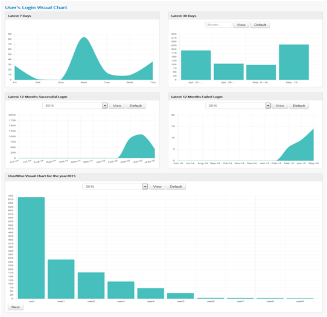

* **At the administrator level:** the latest 7 days, 30 days and 12 months login report displays a successful login count report of every user under the same business unit.
* The user wise visual chart is displayed only for the administrator.
* **At the team level:** the latest 7 days, 30 days and 12 months login report displays a successful login count report of all the reportees reporting to the reporting managers.
.. note:: 1.	The monthly chart is split into week-based chart.
  2.	User can also generate entire month & year wise chart.

**Feedbacks**
^^^^^^^^^^^^
**Training Feedback**
+++++++++++++++++++
* The training feedbacks are available to the administrator, trainer and reporting managers.
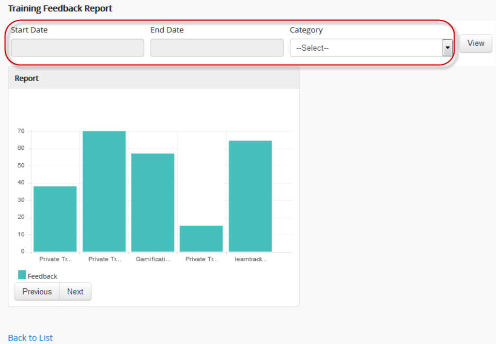

* The chart shows an analogy on the achieved participant feedbacks for each attended classroom trainings, that which is given by the trainer/ administrator.
* The training feedback report can be filtered based on the category, start date and end date.
* *The training feedbacks must satisfy the below given 2 conditions:*

   I.	The classroom trainings must be attached with the participant feedback.
   II.	Any one of the participants must give feedbacks on the respective trainings.
* The training feedback is calculated based on the average sum of users ratings for the training divided by the number of users rated for the trainings.
* There can be only one training feedback for each classroom training.
* The training feedback reports are displayed 5 per page.
* For the training feedback, the attendance must be taken by the trainer or the administrator.

**Trainer Feedback**
+++++++++++++++++++
* The trainer feedback report is available to the administrator, reporting manager and also for the trainer.
* The trainer feedback report can be filtered based on the category, start date and end date.
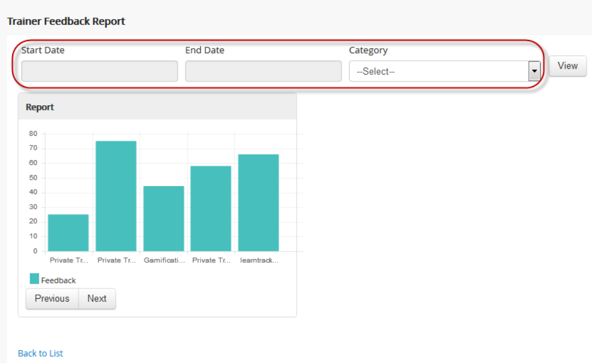
* *The trainer feedback must satisfy the below given 3 conditions:*

      I.	The user defined must be a trainer.
      II.	The classroom trainings must be attached with the trainer feedback.
      III.	Any one of the participants must give feedback on one training.
* The trainer feedback is given by the participants.
* The trainer feedback is calculated based on the feedback percentage given by the participants, for one training that the trainer is assigned to.

**Trainer Status Report**
++++++++++++++++++++++
•	The trainer status report is available only for the trainer.
•	The trainer status report is displayed based on the location status count, i.e., either **Completed or Yet to Complete**.
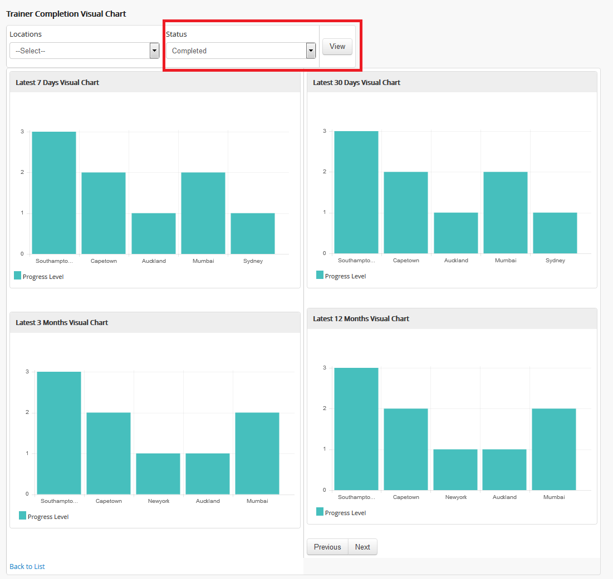

* The trainer is provided with the status count report on the number of trainings completed in the respective locations for the latest 7 days, 30 days, 3 months and 12 months for the trainings assigned to the trainer.
*	A report on the status count for the upcoming 7 days, 30 days, 3 months and 12 months, is also displayed based on the number of trainings that is yet to be completed in the respective locations for the trainings assigned to the trainer.

**Feedback Question Analysis Report**
+++++++++++++++++++++++++++++++++++
•	The feedback question analysis report is available to the administrator and reporting manager.
•	The feedback question analysis report displays, an average count on each question answered by the users / reprotees for any feedbacks.
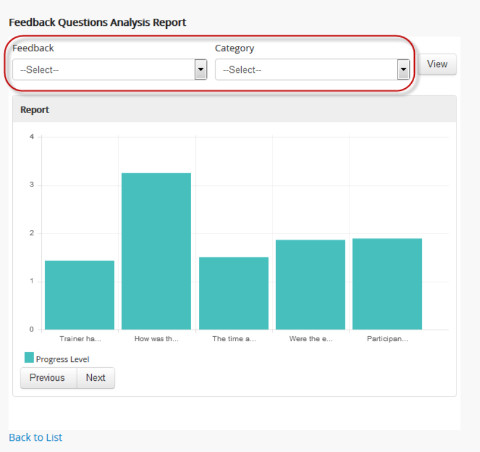

* This is calculated based on the average sum of the ratings given by the user divided by number of users.
* The feedback analysis report can be filtered based on the feedback category.

**Participant Feedbacks**
+++++++++++++++++++++++
•	The participant feedback is available to the administrator and reporting manager.
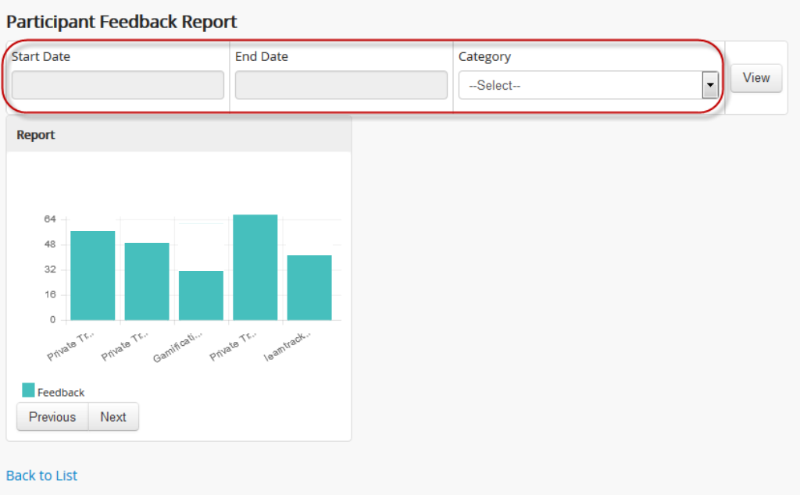

* The participant feedback report can be filtered based on the category, start date and end date.
* The average feedback percentage of all the reportees / users, who have attended the classroom trainings, will be displayed.
* This is calculated based on the average sum of ratings provided by the trainers for all users on the particular trainings.

**User Report**
---------------
* The user report generates a complete progress report of all the users under same *business unit, total usage, hours spent* on both **e-learning courses** and **classroom trainings**.
* A filtered report can be generated based on the *User Name, Start and End Date*.
* This report can be **exported** to the excel in the .csv file format.

*To access:*

    | Click **Admin > Manage Users > Users > Consolidated Report > User Report**. The following **Report** screen appears as shown below.
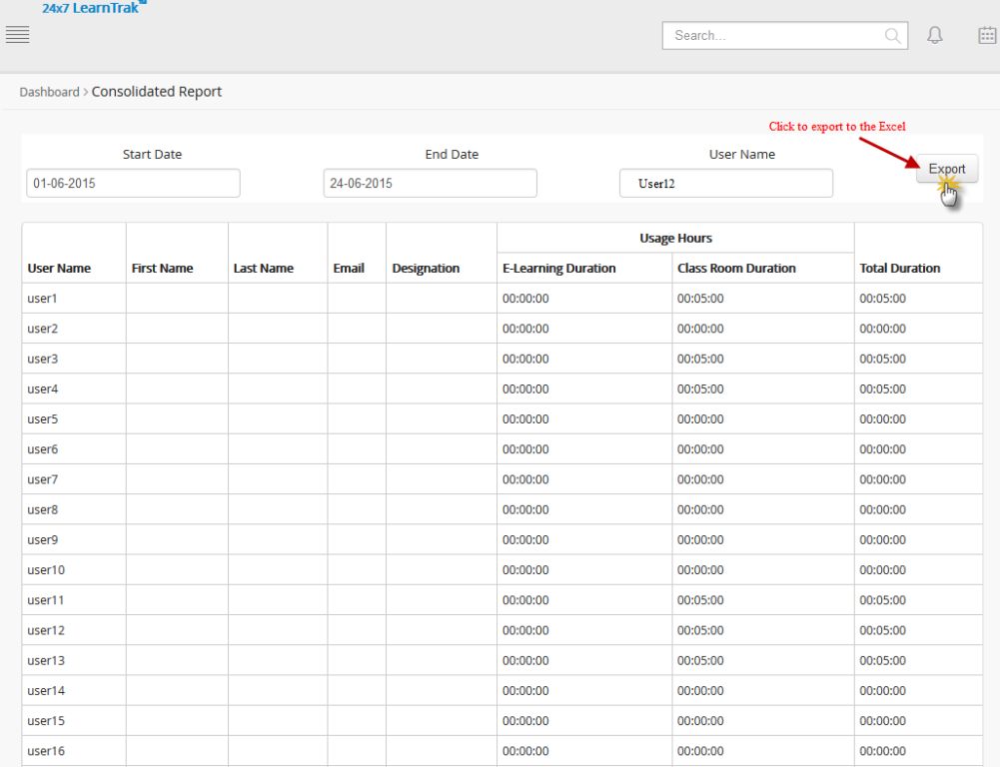

**TNI Report**
--------------
 * This generates detailed report on the *training need identification (TNI)* for the all the published users under the same business unit.
 * *To access:*

      Click **Admin > Manage Users > Users > Consolidated Report > TNI Report**.

      .. image:: _static/user_tni_rep.png
       :height: 250px
       :width: 500 px
       :scale: 120 %
       :align: center

 * Refer :ref:`TNI Report <tni>` under **TNI** for more details.

**Training Cost Estimation**
----------------------------
* The consolidated training cost estimation report displays each instance's total cost for the attended and not attended classroom trainings by the users under same business unit.
* This report can be filtered based on the *Username, Start and End date*.
* The report is exported to the *Excel* in .csv file format.

*To access training cost report:*

    | * Click **Consolidated Report > Training Cost Estimation**. The following **Consolidated Training Cost Details** screen appears as shown below.

    .. image:: _static/admin_training_cost.png
       :height: 250px
       :width: 500 px
       :scale: 120 %
       :align: center

  | * Click **Export to Excel** to export the report to the .csv file.
