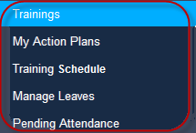
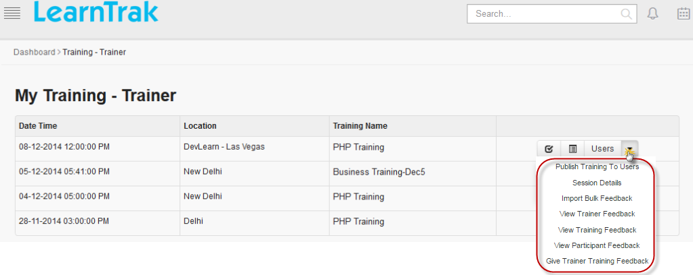
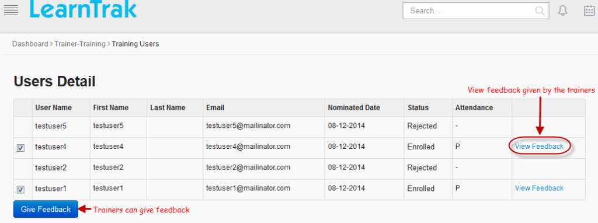
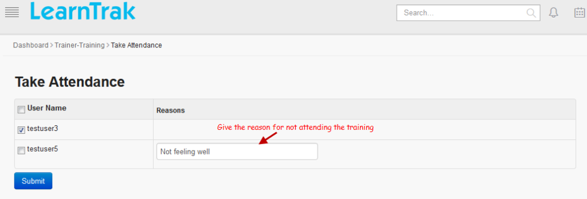
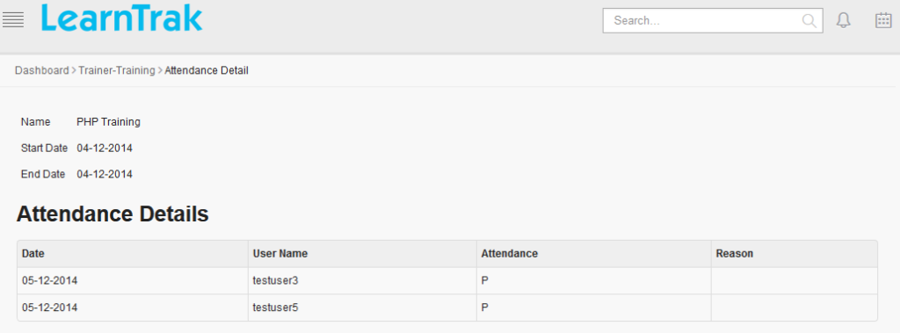
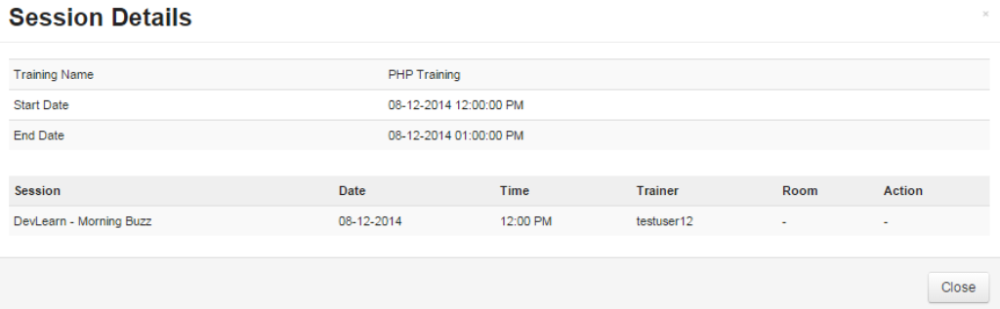
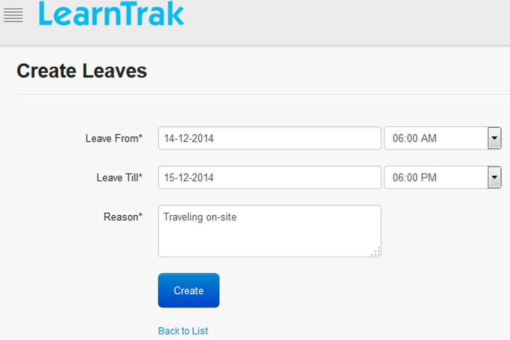
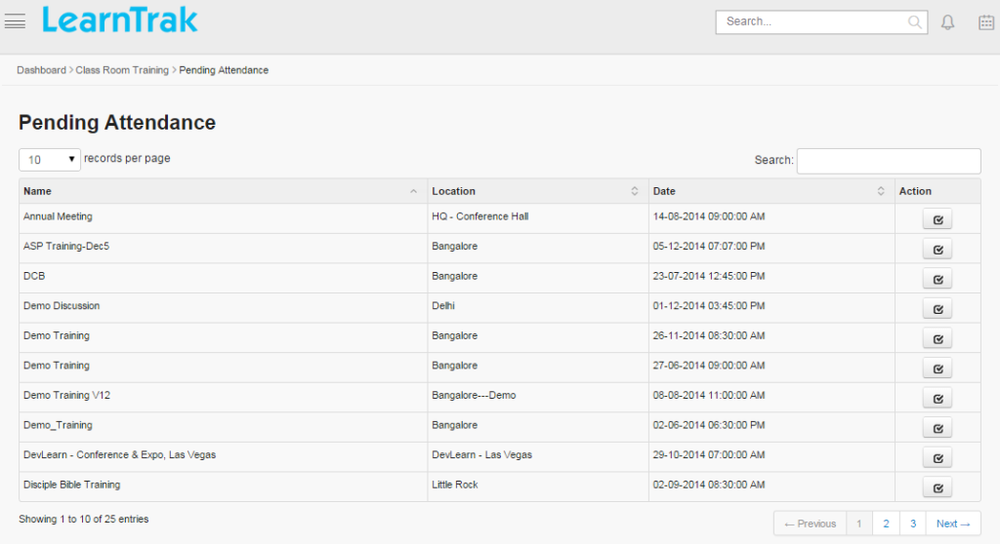

.. _trainer:
.. |Classroom-Button| image:: _static/class_button.png

**Trainer**
========

*	The trainer is also a user who is assigned with the task to train the *Learners*, i.e. single users or group users.
*	A trainer can be an *internal trainer* or *external trainer*.
*	The administrator has the right to assign any user as an internal-trainer.
*	The trainer can check for the trainings assigned by the administrator and perform the task such as taking the attendance and provide feedback on the trainings and the participants.
*	The **Training Schedule, Manage Leaves, Pending Attendance** and **Trainings** tabs is available to the trainers.
*	The trainer can also play the role of an *administrator* or the :ref:`reporting manager <reporting manager>`.
*	The trainer’s can view the visual reports for the *training feedback, trainer feedback* and *trainer status feedback*.

*To access trainer account:*

    Click |Classroom-Button| **Classroom >**

      | **1) Training Schedule**
      | **2) Manage Leaves**
      | **3) Pending Attendance**

**My Training Schedule**
----------------------
The *Training Schedule* tab displays a list of the trainings assigned to the trainer. The trainer performs the following tasks:

*	View user’s report on the assigned trainings.
*	Take attendance of users for a particular training.
*	View training attendance details.
*	View trainer session details of a particular training.
*	View trainer’s feedback.
*	Give participants feedback.

**Users' Detail**
...............
* Trainer must give the participant feedback on the users enrolled for the trainings.
* The users' detail displays status report on the particular user enrolled for the classroom trainings, like:

  - | **Enrolled**
  - | **On Waiting List**
  - | **Pending Approval**
  - | **Rejected**

*To access details:*

    Click **Users**. The following **Users Details** screen appears displaying details of the users who have attended the training.

**Take Attendance**
................
The take attendance screen allows the trainers to take the attendance of the users enrolled for the classroom training.

.. |Take_Attendance| image:: _static/tk_at_button.png

*To take attendance:*

  | * Click **Take Attendance** |Take_Attendance|. The following **Take Attendance** screen appears.
  | * Select the user name > click **Submit**.
  | * **Reason** field is filled, only if the user is not attending the training session.

**Publish Training to Users**
............................
* The trainer can also publish the trainings to multiple users.
* The newly added users' are enrolled directly to the training instances, i.e., it by-passes the rule for self-nomination to the classroom trainings.
* The trainer can also cancel the users' training nominations.
* Refer :ref:`User Details and Status Types <new instance>` under **Classroom Training > Manage Training > Create New Instances** to add adhoc users to the classroom training.

**Attendance Details**
...................
The attendance details screen displays attendance information of the users who are enrolled and present for the classroom trainings.

*To view attendance details:*

    Click **Attendance Details** |Attendance_Details|. The following **Attendance Details** screen appears displaying attendance details.

**Session Details**
................
The session details screen displays the trainer’s classroom training session information.

*To view session details:*

    Click **Session Details**. The following **Session Details** screen appears displaying details.

**View Trainer, Training, Participant Feedbacks**
...................................................
* The **View Trainer Feedback** displays the feedback details on the trainer given by the users'.
* The **View Training Feedback** displays the feedback details on the training instances given by the users'.
* The **View Participant Feedback** displays the feedback details on the users' given by the trainer.

*To view feedbacks:*

    i. Click **View Trainer Feedback**. The following **Feedback Report Details** screen appears displaying details on the trainer feedback.

          .. image:: _static/view_trainer_feed.png
             :height: 250px
             :width: 550 px
             :scale: 180 %
             :align: center

    ii. Click **View Training Feedback**. The **Feedback Report Details** screen appears displaying details on the training feedback.

    iii. Click **View Participant Feedback**. The following **Participant Feedback Report Details** screen appears displaying details on the particiapnt feedback.

        .. image:: _static/participant_feed.png
           :height: 250px
           :width: 550 px
           :scale: 180 %
           :align: center

**Give Trainer Training Feedback**
..................................
* The *Give Trainer Training Feedback* displays the classroom training feedbacks given by the trainer.
* The **trainer training feedback** is available to the trainer only if the trainer training  feedback form is attached to the classroom training.
* The administrator can view these feedbacks under **View Trainer Training Feedback**.

*To view trainer feedbacks:*

    Click **Give Trainer Training Feedback**. The following **Feedback Questions** screen appears.

    .. image:: _static/trainer_feed.png
       :height: 250px
       :width: 500 px
       :scale: 110 %
       :align: center

**Manage Leaves**
--------------
* The **Internal-Trainer** can apply for the leave at any time.
* The leaves applied will be reflected during creation of the new trainings.
* Based on the trainer availability, the respective classroom training will be assigned.

*To manage leaves:*

    Click **Create Leave**. The following **Create Leave** screen appears with relevant fields to be filled.

**Trainings**
----------
* The Trainings tab displays the classroom trainings allocated to the trainer.
* The trainer can only view the *My Training, Available Training and Company Trainings* tabs of the particular classroom training.

.. |classroom| image:: _static/class_button.png

*To access training:*

    Click |classroom| **Classroom > Trainings**. It is redirected to **Trainings** screen.
.. note:: Trainer can also self-nominate to the classroom trainings, but cannot nominate if is assigned as a trainer for the same classroom training.

**Trainer Pending Attendance**
---------------------------
The trainer’s pending attendance displays a list of all the pending user attendance to be taken by the trainer for the assigned classroom training instances.

*To take pending attendance:*

    Click |classroom| **Classroom > Pending Attendance**. The following **Pending Attendance** screen appears displaying pending attendance details.

.. note:: The *Take Attendance* |Take_Attendance| redirects to the take attendance screen.
