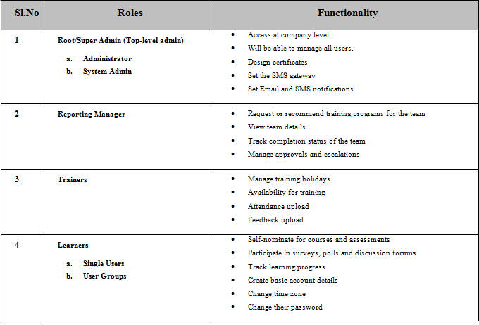

.. _users:

**LMS User Roles**
================
* The LMS allows users to be created as a single user or group users. The **Super Admin** is placed at the top-level of the :ref:`business units <business-units>` hierarchy having all the rights to create and classify the :ref:`single users <single users>` or :ref:`group users <group users>` under various business units.
* All users must be associated with only one business unit. The users created can be assigned to the **BU Admin** role, where each BU Admin has the right and privilege on each users grouped under various business units.

**There are 4 types of user roles supported by LearnTrak LMS:**

.. note:: - The *Super Admin* is also a user and can play multiple roles at the same time as a :ref:`reporting manager <reporting manager>`, :ref:`trainer <trainer>`, or administrator.
 - The **Tenants** and the **Plan ID** are featured only to the *Super Admin*.
